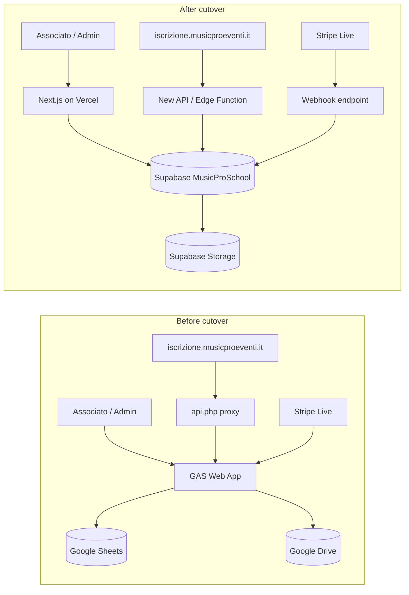

# MusicPro School — Big Bang Cutover Runbook

Weekend migration from **Google Apps Script (GAS)** + Google Sheets to **Supabase (MusicProSchool project)** + **musicpro/** monorepo.

| Attribute | Value |
|-----------|-------|
| Strategy | **Big bang** — no parallel run |
| Cutover window | Saturday 08:00–20:00 CET (recommended) |
| Rollback window | Same day, before GAS decommission (see §7) |
| App Store / Expo | **Not required** for cutover v1 (web + iscrizione subdomain only) |
| Supabase project | **MusicProSchool** — separate from MusicProEventi |

---

## 1. Architecture at cutover



**Current production paths (GAS):**

- Admin UI: GAS web app (`Codice.js` / `index.html`) via Apps Script deployment URL
- Public enrollment: `https://iscrizione.musicproeventi.it/` → `api.php` → GAS (`deploy-iscrizione.js`, `GAS_ISCRIZIONE_URL` in `.env.example`)
- Stripe webhook (GAS): `POST …/exec?action=stripeWebhookPagamento&token=STRIPE_WEBHOOK_TOKEN` (`StripePagamenti.js`)
- Stripe return URL: `STRIPE_RETURN_URL=https://iscrizione.musicproeventi.it/` (`.env.example`)

**Target production paths (new stack):**

- Admin UI: Next.js app (`musicpro/apps/web`) on Vercel — e.g. `https://school.musicproeventi.it` or custom domain TBD
- Public enrollment: same subdomain; static HTML + API pointing to Supabase Edge Function or Next.js route (not GAS)
- Stripe webhook: signed endpoint using `STRIPE_WEBHOOK_SECRET` (`musicpro/.env.example`) — **not** query-token auth
- Auth: Supabase email/password + `ensure_member_linked()` (replaces GAS `_LOGIN_TOKENS` magic links)

---

## 2. Timeline estimate (solo dev + AI)

| Phase | When | Effort | Owner |
|-------|------|--------|-------|
| Pre-cutover validation | Week −2 to −1 | 2–3 evenings | Dev + AI |
| Staging rehearsal (full dry run) | Week −1 (Thu/Fri) | 1 evening | Dev |
| Communication to segreteria | Week −1 | 30 min | Dev |
| **Cutover execution** | **Weekend Sat** | **6–10 h** | Dev |
| Smoke tests + monitoring | Sat PM / Sun | 2–3 h | Dev |
| GAS decommission | Mon after stable cutover | 1–2 h | Dev |
| First-week stabilization | Days 1–7 post-cutover | 1 h/day | Dev |

**Total calendar:** ~2 weeks prep + 1 weekend switch + 1 week watch.

AI assistance is assumed for: migration script fixes, webhook handler parity with `StripePagamenti.js`, deploy config, and SQL troubleshooting.

---

## 3. Pre-cutover validation (Week −2 to −1)

Complete **all** items before opening the cutover window. Use a **dedicated Supabase staging project** or a disposable branch DB if available; never first-test on production MusicProSchool.

### 3.1 Supabase MusicProSchool project setup

1. Create Supabase project **MusicProSchool** (do not reuse MusicProEventi).
2. Apply migrations **in strict order**:

   ```bash
   cd "/Users/mauroandreoni/Cursor/MusicPro School"
   supabase link --project-ref <MUSICPRO_SCHOOL_REF>
   supabase db push
   ```

   Or manually via SQL editor / `psql`:

   | Order | File | Purpose |
   |-------|------|---------|
   | 001 | `supabase/migrations/001_initial_schema.sql` | Tables, enums, `audit_log`, RLS enable |
   | 002 | `supabase/migrations/002_rls_policies.sql` | Role-based policies |
   | 003 | `supabase/migrations/003_seed_data.sql` | Rooms, quota years, `app_settings` |
   | 004 | `supabase/migrations/004_auth_hooks.sql` | `link_member_on_auth_signup`, `ensure_member_linked` |
   | 005 | `supabase/migrations/005_booking_functions.sql` | `create_booking_safe()` |

3. **Seed verification** — confirm in Dashboard → Table Editor:
   - `rooms`: 4 rows (Sala 1–4)
   - `annual_quota_settings`: 2024–2026 placeholder amounts
   - `app_settings`: timezone, legacy Drive IDs, admin emails

4. **Storage buckets** (create in Dashboard if not in migrations):
   - `reimbursements`, `enrollments` (keys in `app_settings`)

5. **Auth configuration** (Supabase Dashboard → Authentication):
   - Site URL: production Next.js URL
   - Redirect URLs: production + `http://localhost:3000/**` for dev
   - Email provider configured (SMTP or Supabase default)
   - Decide: email confirmation on/off for launch

6. **Enable Realtime** on `bookings` (should be in 001; verify publication).

### 3.2 Environment variables

**Root `.env`** (migration + iscrizione deploy — see `.env.example`):

```env
GOOGLE_SERVICE_ACCOUNT_JSON=/path/to/sa.json
SPREADSHEET_ID=1vwyCTqXJDe0IKr_tIH2Dgz5ewlTo-OCnTxH2WNSYAOU
SUPABASE_URL=https://<musicpro-school>.supabase.co
SUPABASE_SERVICE_ROLE_KEY=eyJ...

FTP_HOST_ISCRIZIONE=iscrizione.musicproeventi.it
ISCRIZIONE_FTP_USER=...
FTP_PASS_ISCRIZIONE=...
ISCRIZIONE_FTP_REMOTE_PATH=/

STRIPE_MODE=test                    # test until cutover hour; then live
STRIPE_SECRET_KEY_TEST=sk_test_...
STRIPE_SECRET_KEY_LIVE=sk_live_...
STRIPE_PUBLIC_KEY_TEST=pk_test_...
STRIPE_PUBLIC_KEY_LIVE=pk_live_...
STRIPE_WEBHOOK_TOKEN=               # legacy GAS only — keep until GAS off
STRIPE_RETURN_URL=https://iscrizione.musicproeventi.it/
STRIPE_CURRENCY=eur
```

**`musicpro/.env`** (see `musicpro/.env.example`):

```env
NEXT_PUBLIC_SUPABASE_URL=https://<musicpro-school>.supabase.co
NEXT_PUBLIC_SUPABASE_ANON_KEY=...
EXPO_PUBLIC_SUPABASE_URL=...        # same project; optional for v1
EXPO_PUBLIC_SUPABASE_ANON_KEY=...
SUPABASE_SERVICE_ROLE_KEY=...

STRIPE_SECRET_KEY=sk_test_...       # or sk_live_ at cutover
NEXT_PUBLIC_STRIPE_PUBLISHABLE_KEY=pk_test_...
STRIPE_WEBHOOK_SECRET=whsec_...     # from Stripe Dashboard webhook endpoint
STRIPE_CURRENCY=eur
```

Set the same values in **Vercel** project settings (Production environment).

### 3.3 Data migration dry-run

From project root:

```bash
npm install
npm run migrate:sheets -- --dry-run
```

**Acceptance criteria:**

| Sheet | Expected | Action if mismatch |
|-------|----------|-------------------|
| ASSOCIATI | Member count matches sheet data rows | Fix duplicates / tax_code in sheet |
| IMPOSTAZIONI_QUOTE + QUOTE | Settings + per-member quotas | Re-run `--only=quotas` after members |
| NOTULE | Row count ~ sheet (minus skipped zero-gross) | Resolve `member not found` names |
| ISCRIZIONI | All `legacy_enrollment_id` present | Check payment_status distribution |
| TEMPLATE | Template count matches | — |

Record baseline counts from dry-run output (inserted/skipped/errors per sheet).

**Live migration on staging:**

```bash
npm run migrate:sheets
```

Reconcile counts:

```sql
SELECT 'members' AS t, count(*) FROM members
UNION ALL SELECT 'member_annual_quotas', count(*) FROM member_annual_quotas
UNION ALL SELECT 'reimbursements', count(*) FROM reimbursements
UNION ALL SELECT 'enrollments', count(*) FROM enrollments
UNION ALL SELECT 'message_templates', count(*) FROM message_templates;
```

Compare to dry-run totals ± skipped rows documented in `scripts/migrate-from-sheets/README.md`.

### 3.4 Auth test

1. Pick 3 migrated members (admin, docente, associato) with known emails.
2. Sign up / sign in on staging web (`npm run dev` in `musicpro/apps/web`).
3. Verify `members.user_id` populated (`ensure_member_linked` / trigger 004).
4. Verify login **fails gracefully** for email not in `members`.
5. Test password reset flow if enabled.

### 3.5 Booking test

On staging, as associato **with current-year quota paid**:

1. Open `/prenotazioni`
2. Book a slot → expect success or Italian error from `create_booking_safe`
3. Book same slot again → `SLOT_TAKEN`
4. Open second browser → Realtime refresh on slot grid

As associato **without quota** → `QUOTA_NOT_PAID`.

### 3.6 Stripe test mode

Before cutover, validate end-to-end in **Stripe Test mode**:

1. Create test webhook endpoint pointing to staging URL:
   - **Option A (recommended):** Supabase Edge Function `stripe-webhook`
   - **Option B:** Next.js `POST /api/stripe/webhook`

2. Subscribe to same events as GAS (`StripePagamenti.js` header):
   - `checkout.session.completed`
   - `checkout.session.async_payment_succeeded`
   - `payment_intent.succeeded`

3. New handler must replicate GAS behavior:
   - Read `metadata.mp_id_iscrizione` (or PI metadata lookup)
   - Idempotency on `evt_*` and payment intent
   - Update `enrollments.payment_status`, centesimi, `paid_at`
   - Deactivate Payment Link after success
   - Trigger confirmation email / PDF generation (when implemented)

4. Test Payment Link checkout → webhook → enrollment row `PAGATO` equivalent.

5. Keep GAS webhook **disabled in Stripe Live** until cutover hour (or run both briefly only if testing live — avoid duplicate processing).

---

## 4. Cutover weekend — execution order

**Freeze recommendation:** Friday 22:00 — stop accepting new GAS enrollments (maintenance banner on `iscrizione.html`) or accept that last-hour GAS rows need manual reconcile.

### Phase A — Database & data (Sat 08:00–10:00)

| Step | Action |
|------|--------|
| A1 | Announce maintenance (email segreteria / Telegram if used) |
| A2 | **Final GAS snapshot:** export or note last spreadsheet revision (optional safety) |
| A3 | Apply migrations 001–005 on **production** MusicProSchool (if not already) |
| A4 | Run **live** migration: `npm run migrate:sheets` |
| A5 | Run count reconciliation SQL (§3.3) — **abort cutover if >0 unexplained errors** |
| A6 | Spot-check 5 random members, 5 reimbursements, 5 enrollments in Supabase Dashboard |
| A7 | Assign `member_roles` for admin/segreteria/docente users if not migrated from sheet |

### Phase B — Application deploy (Sat 10:00–12:00)

| Step | Action |
|------|--------|
| B1 | Deploy Next.js admin to **Vercel** (`musicpro/apps/web`): `npm run build` → production deploy |
| B2 | Configure custom domain (e.g. `school.musicproeventi.it`) + SSL |
| B3 | Set all Vercel env vars from §3.2 |
| B4 | Deploy Supabase Edge Functions (enrollment API, Stripe webhook) if used |
| B5 | Update **iscrizione site**: replace `api.php` GAS proxy with new backend URL |
| B6 | Deploy static assets via FTP: `npm run deploy:iscrizione` **after** updating deploy script/env to point `api.php` at new API (not `GAS_ISCRIZIONE_URL`) |
| B7 | Update `STRIPE_RETURN_URL` if confirmation page path changed |

### Phase C — Stripe webhook migration (Sat 12:00–13:00) ⚠️ Critical path

**Old (GAS):**

```
POST https://script.google.com/macros/s/<DEPLOYMENT_ID>/exec?action=stripeWebhookPagamento&token=<STRIPE_WEBHOOK_TOKEN>
```

**New (choose one primary):**

| Target | URL pattern | Secret |
|--------|-------------|--------|
| Supabase Edge Function | `https://<project>.supabase.co/functions/v1/stripe-webhook` | `STRIPE_WEBHOOK_SECRET` (Stripe signing) |
| Next.js API route | `https://<vercel-domain>/api/stripe/webhook` | `STRIPE_WEBHOOK_SECRET` |

**Cutover sequence:**

1. Deploy new webhook handler; verify with Stripe CLI: `stripe listen --forward-to <new-url>`
2. In Stripe Dashboard (**Live mode**), **add** new endpoint + copy `whsec_…` to env
3. Send test event from Dashboard → confirm enrollment update in Supabase
4. **Disable or delete** GAS webhook endpoint in Stripe Live (prevents double-processing)
5. Switch `STRIPE_MODE=live` / production Stripe keys in all envs
6. Create a real €0.50 test enrollment if needed, then refund (optional smoke)

> **Do not** run GAS and new webhooks on the same Live events. GAS uses query `token=`; new stack uses `Stripe-Signature` header — they are independent endpoints.

### Phase D — DNS & traffic switch (Sat 13:00–14:00)

| Asset | Host | Action |
|-------|------|--------|
| Admin app | Vercel custom domain | Point DNS CNAME → Vercel; verify HTTPS |
| Iscrizione form | `iscrizione.musicproeventi.it` | FTP deploy new `index.html` + `api.php`; TTL already low if pre-set |
| GAS admin URL | `script.google.com/.../exec` | Keep alive for rollback until Phase F |
| Email links | Magic links in old emails | Expire naturally; new auth is Supabase |

**App Store:** not in scope for v1. Expo app (`musicpro/apps/mobile` if present) can stay unreleased.

### Phase E — Smoke tests (Sat 14:00–16:00)

Run in order:

1. [ ] Admin login (email/password) → dashboard loads
2. [ ] Member list visible with expected count
3. [ ] Reimbursement list for current year loads
4. [ ] `/prenotazioni` — book and cancel a test slot
5. [ ] Public enrollment form submit → row in `enrollments`
6. [ ] Stripe Payment Link → pay (live or test per mode) → webhook → `payment_status` paid
7. [ ] `conferma-pagamento` / return URL loads on iscrizione subdomain
8. [ ] Supabase logs: no RLS violations for normal flows

### Phase F — GAS decommission (Mon+, only if Phase E green)

See `docs/GAS_DEPRECATION.md`. Summary:

1. Disable GAS web app deployment (Manage deployments → archive)
2. Revoke OAuth / service tokens no longer needed
3. Archive clasp project locally; remove triggers
4. Keep Google Sheet **read-only** archive (do not delete)

---

## 5. Rollback plan (if cutover fails)

**Trigger rollback if:** auth broken for all admins, migration counts wrong, Stripe payments not recording, or enrollment form down >2 h during window.

Rollback is viable **only before Phase F** (GAS still deployed).

| Step | Rollback action |
|------|-----------------|
| R1 | Re-enable GAS Stripe webhook in Dashboard; disable new endpoint |
| R2 | Redeploy `api.php` with original `GAS_ISCRIZIONE_URL` via `deploy-iscrizione.js` |
| R3 | Point admin users back to GAS web app URL (bookmark / comms) |
| R4 | Set maintenance off on iscrizione site |
| R5 | **Do not** delete Supabase data — mark project as failed cutover; fix and retry |
| R6 | Document root cause before second attempt |

**Data note:** Rows created in Supabase during failed cutover may need manual merge into Sheets or discard — prefer cutover freeze to minimize this.

---

## 6. Post-cutover — first week

### 6.1 Monitor `audit_log`

```sql
SELECT created_at, actor_member_id, action, entity_type, entity_id, metadata
FROM audit_log
ORDER BY created_at DESC
LIMIT 50;
```

Watch for unexpected bulk deletes, failed auth linking, or missing actor on admin actions.

Also monitor:

- Supabase Dashboard → Logs (API, Auth, Edge Functions)
- Vercel → Functions / middleware errors
- Stripe Dashboard → Webhooks delivery failures

### 6.2 First-week tasks

| Day | Task |
|-----|------|
| D+0 | Confirm no Stripe webhook failures; check pending enrollments |
| D+1 | Segreteria walkthrough on new admin UI |
| D+2 | Verify associato logins (sample 10 users); fix orphan `members.user_id` |
| D+3 | Room booking usage — quota + conflict errors |
| D+4 | Compare new enrollment count vs expectations |
| D+5 | Disable GAS triggers / clasp push if not done |
| D+7 | Retrospective; close cutover ticket; update `GAS_DEPRECATION.md` status |

### 6.3 Known v1 gaps (not blockers for cutover)

Documented in migration README — plan post-cutover sprints:

- Historical NOTULE PDF URLs not imported (`pdf_url` null)
- Full admin feature parity with GAS `index.html` (reports, bulk Telegram, import wizard)
- Reimbursement PDF generation → Supabase Storage (was Drive + Docs)
- Mobile app release

---

## 7. Reference files

| File | Role in cutover |
|------|-----------------|
| `deploy-iscrizione.js` | FTP deploy to `iscrizione.musicproeventi.it`; generates `api.php` proxy |
| `.env.example` | Iscrizione FTP, GAS URL, Stripe keys (legacy) |
| `musicpro/.env.example` | Supabase + Stripe webhook secret (new stack) |
| `StripePagamenti.js` | GAS webhook contract: events, metadata, idempotency |
| `scripts/migrate-from-sheets/` | `npm run migrate:sheets` orchestrator |
| `supabase/migrations/001`–`005` | Schema, RLS, seed, auth, bookings |
| `.clasp.json` | GAS script ID for decommission |
| `docs/GAS_DEPRECATION.md` | Feature mapping and disable schedule |
| `docs/CUTOVER_CHECKLIST.md` | Printable checkbox list |

---

## 8. Communication template (segreteria)

> **Oggetto:** Manutenzione MusicPro School — [DATA]**
>
> Sabato [DATA] dalle 8:00 alle 16:00 la piattaforma associati sarà in manutenzione.
> - Modulo iscrizione online: possibile interruzione breve
> - Area admin: nuovo indirizzo [URL] domenica
> - Login: email + password (non più link magico via email GAS)
>
> Per urgenze: [contatto]

---

*Last updated: cutover runbook v1 — big bang, MusicProSchool Supabase, no parallel run.*
