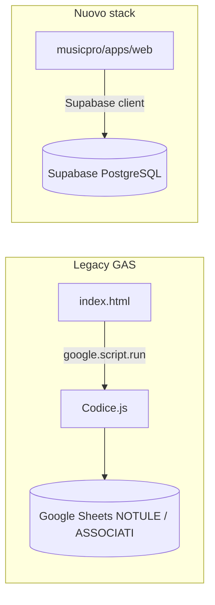

# Stato migrazione `index.html` → admin Next.js / Supabase

**Data analisi:** 11 giugno 2026  
**File legacy:** `index.html` (~5000 righe) + backend GAS `Codice.js`  
**Nuovo admin:** `musicpro/apps/web` — rotte `/admin/*`

---

## Stato attuale

| Domanda | Risposta |
|---------|----------|
| `index.html` usa ancora GAS? | **Sì** — ~50 chiamate `google.script.run` verso `Codice.js` |
| `index.html` chiama Supabase? | **No** — nessun riferimento a Supabase, `/admin` o API REST |
| Nuovo admin collegato al DB? | **Sì** — Next.js legge/scrive `reimbursements`, `members` via `@musicpro/database` |
| Percorso previsto per l'admin | **`/admin`** (login Supabase obbligatorio) |

### Backend dati per sezione

**Implicazione:** finché gli operatori usano l'URL GAS, rubrica e rimborsi continuano a scrivere su **Google Sheets**, non su Supabase. I dati storici sono già migrati; le **nuove operazioni** devono passare dal pannello Next.js.

---

## URL admin

| Ambiente | URL base | Note |
|----------|----------|------|
| Produzione (target cutover) | `https://school.musicproeventi.it/admin` | Da confermare in deploy Vercel — vedi `docs/CUTOVER.md` |
| Sviluppo locale | `http://localhost:3000/admin` | `npm run dev` in `musicpro/apps/web` |
| Login | `/login?redirect=/admin` | Email + password Supabase (no magic link GAS) |

### Rotte admin implementate

| Rotta | Descrizione | Ruoli |
|-------|-------------|-------|
| `/admin` | Redirect a rubrica o rimborsi in base al ruolo | admin, docente, segreteria |
| `/admin/associati` | Lista associati | admin, segreteria |
| `/admin/associati/nuovo` | Nuovo associato | admin, segreteria |
| `/admin/associati/[id]` | Dettaglio / modifica associato | admin, segreteria |
| `/admin/rimborsi` | Gestione rimborsi (notule) | admin, docente |

---

## Banner migrazione in `index.html`

È stato aggiunto un banner informativo sotto l'header GAS che punta al nuovo admin:

- Costante JS: `NEW_ADMIN_URL` (default `https://school.musicproeventi.it/admin`)
- Elemento: `#gas-migration-banner` / `#new-admin-link`

**Al cutover:** aggiornare `NEW_ADMIN_URL` con il dominio produzione definitivo e ridistribuire il web app GAS (oppure disabilitare GAS del tutto — vedi `docs/GAS_DEPRECATION.md`).

---

## Matrice parità funzionale

Legenda: ✅ disponibile · ⚠️ parziale · ❌ non migrato · 🔒 solo GAS

### Navigazione e autenticazione

| Funzione | `index.html` (GAS) | `/admin` (Next.js) |
|----------|-------------------|---------------------|
| Login magic link GAS | ✅ | ❌ (sostituito da Supabase Auth) |
| Login email/password | ❌ | ✅ |
| Rubrica associati | ✅ Sheets | ✅ Supabase `members` |
| Quote annuali | ✅ | ❌ |
| Rimborsi | ✅ Sheets NOTULE | ✅ Supabase `reimbursements` |
| Impostazioni / Drive / import | ✅ | ❌ |

### Rimborsi — dettaglio

| Funzione | `index.html` | `/admin/rimborsi` |
|----------|--------------|-------------------|
| Elenco per anno / associato | ✅ | ✅ |
| Totale importi anno | ✅ (report) | ✅ (header pannello) |
| Generazione singola notula | ✅ multi-form + bulk | ✅ form singolo |
| Generazione multipla (batch) | ✅ | ❌ |
| Calcolo progressivo automatico | ✅ | ✅ (lato DB in `generateReimbursement`) |
| Pagamenti parziali multi-riga | ✅ | ❌ (un solo metodo/importo) |
| Avviso debito ricevute passate | ✅ `getAssociateReceiptsSurplus` | ❌ |
| Modifica importo ricevute | ✅ | ✅ |
| Stato ricevute (badge) | ✅ | ✅ |
| Visualizza PDF notula | ✅ (Drive URL) | ❌ (`pdf_url` null; TODO Storage) |
| Invio email notula | ✅ checkbox per invio | ❌ |
| Eliminazione singola | ✅ | ✅ (solo admin) |
| Eliminazione / email bulk | ✅ | ❌ |
| Report totale / dettagliato | ✅ | ❌ |
| Ricerca associato typeahead | ✅ | ✅ (select / filtro) |
| Vincolo docente (solo propri rimborsi) | ⚠️ (logica GAS) | ✅ `isDocenteOnly` |
| Backend dati | Google Sheets NOTULE | **Supabase** |

### Rubrica associati — dettaglio

| Funzione | `index.html` | `/admin/associati` |
|----------|--------------|---------------------|
| Lista + ricerca | ✅ | ✅ |
| Dettaglio / modifica | ✅ | ✅ |
| Nuovo associato | ✅ | ✅ |
| Selezione multipla + messaggi | ✅ | ❌ |
| Compatta duplicati | ✅ | ❌ |
| Libro associati PDF | ✅ | ❌ |
| Import wizard storico | ✅ | ❌ (sostituito da `migrate:sheets`) |
| Backend dati | Google Sheets ASSOCIATI | **Supabase** |

### Quote e impostazioni (solo GAS)

| Funzione | `index.html` | Next.js |
|----------|--------------|---------|
| Registrazione quote massive | ✅ | ❌ |
| Impostazioni importo quota annuale | ✅ | ❌ |
| Template messaggi | ✅ | ❌ (tabella migrata, UI assente) |
| Messaggistica massiva email/Telegram | ✅ | ❌ |
| Path cartelle Google Drive | ✅ | ❌ (`app_settings` seed) |
| Formatta fogli / compatta duplicati | ✅ | ❌ |

---

## Cosa cambiare per “puntare al nuovo database”

**Non serve** riscrivere `index.html` per chiamare Supabase direttamente. Il percorso previsto è:

1. **Cutover operativo:** comunicare alla segreteria l'URL `/admin` e le credenziali Supabase.
2. **Aggiornare** `NEW_ADMIN_URL` in `index.html` al dominio produzione.
3. **Deploy** Next.js su Vercel con variabili `NEXT_PUBLIC_SUPABASE_*`.
4. **Disabilitare** il web app GAS dopo smoke test (`docs/CUTOVER.md`, `docs/GAS_DEPRECATION.md`).
5. **Opzionale:** redirect HTTP 301 dal dominio GAS al nuovo admin (non implementato in GAS; possibile a livello DNS / proxy).

### Cosa NON fare (scope)

- Patchare ogni `google.script.run` in `index.html` → Supabase REST (5000+ righe, alto rischio).
- Continuare a creare rimborsi su NOTULE dopo il cutover (divergenza dati).

---

## Prossimi passi consigliati

| Priorità | Azione |
|----------|--------|
| Alta | Confermare dominio produzione admin e deploy Vercel |
| Alta | Smoke test login + `/admin/rimborsi` con dati migrati (135 righe 2025–2026) |
| Media | Implementare generazione PDF notule → Supabase Storage |
| Media | Portare gestione quote su Next.js |
| Bassa | Report rimborsi, email bulk, Telegram |
| Cutover | Disattivare GAS; rimuovere banner legacy |

---

## Riferimenti

- Verifica import rimborsi: `docs/MIGRATION_VERIFY_RIMBORSI.md`
- Deprecazione GAS: `docs/GAS_DEPRECATION.md`
- Runbook cutover: `docs/CUTOVER.md`
- Componente rimborsi: `musicpro/apps/web/src/components/admin/reimbursements-panel.tsx`
- Logica DB rimborsi: `musicpro/packages/database/src/reimbursements.ts`
