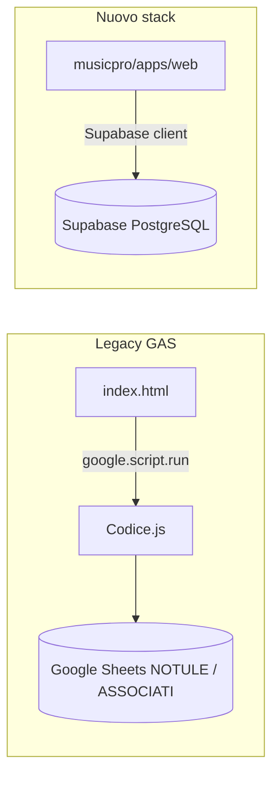

# Stato migrazione `index.html` → admin Next.js / Supabase

**Data analisi:** 15 agosto 2026  
**File legacy:** `index.html` (~5000 righe) + backend GAS `Codice.js`  
**Nuovo admin:** `musicpro/apps/web` — rotte `/admin/*`

---

## Stato attuale

| Domanda | Risposta |
|---------|----------|
| `index.html` usa ancora GAS? | **Sì** — ~50 chiamate `google.script.run` verso `Codice.js` (fino a cutover) |
| `index.html` chiama Supabase? | **No** — nessun riferimento a Supabase, `/admin` o API REST |
| Nuovo admin collegato al DB? | **Sì** — Next.js legge/scrive via `@musicpro/database` |
| Parità funzionale admin | **✅ Completa** (vedi matrice sotto) |
| Percorso previsto per l'admin | **`/admin`** (login Supabase obbligatorio) |

### Backend dati per sezione

```mermaid
flowchart LR
  subgraph legacy [Legacy GAS]
    IH[index.html]
    GAS[Codice.js]
    SH[(Google Sheets NOTULE / ASSOCIATI)]
    IH -->|google.script.run| GAS
    GAS --> SH
  end

  subgraph nuovo [Nuovo stack]
    WEB[musicpro/apps/web]
    SB[(Supabase PostgreSQL)]
    WEB -->|Supabase client| SB
  end
```

**Implicazione:** finché gli operatori usano l'URL GAS, rubrica e rimborsi continuano a scrivere su **Google Sheets**, non su Supabase. I dati storici sono già migrati; le **nuove operazioni** devono passare dal pannello Next.js.

---

## URL admin

| Ambiente | URL base | Note |
|----------|----------|------|
| Produzione (target cutover) | `https://school.musicproeventi.it/admin` | Deploy Vercel — vedi `docs/CUTOVER.md` |
| Sviluppo locale | `http://localhost:3000/admin` | `npm run dev` in `musicpro/apps/web` |
| Login | `/login?redirect=/admin` | Email + password Supabase (no magic link GAS) |

### Rotte admin implementate (GAS parity)

| Rotta | Descrizione | Ruoli |
|-------|-------------|-------|
| `/admin` | Redirect a rubrica o rimborsi in base al ruolo | admin, docente, segreteria |
| `/admin/associati` | Lista + multi-select messaggi + libro PDF | admin, segreteria |
| `/admin/associati/nuovo` | Nuovo associato | admin, segreteria |
| `/admin/associati/[id]` | Dettaglio / modifica (+ stato quote) | admin, segreteria |
| `/admin/associati/duplicati` | Compatta duplicati (merge + riassegna FK) | admin |
| `/admin/quote` | Impostazioni importo + registrazione massive | admin, segreteria |
| `/admin/rimborsi` | Notule: batch, PDF, email, report, bulk | admin, docente |
| `/admin/template` | CRUD modelli messaggio | admin, segreteria |
| `/admin/impostazioni` | Soglie prenotazioni + nota import Sheets | admin, segreteria |
| `/admin/impostazioni/documenti` | Path Drive / template / bucket / email | admin, segreteria |

*(Altre rotte booking — prenotazioni/sale/shop/penali — sono fuori scope GAS.)*

---

## Banner migrazione in `index.html`

È stato aggiunto un banner informativo sotto l'header GAS che punta al nuovo admin:

- Costante JS: `NEW_ADMIN_URL` (default `https://school.musicproeventi.it/admin`)
- Elemento: `#gas-migration-banner` / `#new-admin-link`

**Al cutover:** aggiornare `NEW_ADMIN_URL` con il dominio produzione definitivo e ridistribuire il web app GAS (oppure disabilitare GAS del tutto — vedi `docs/GAS_DEPRECATION.md`).

---

## Matrice parità funzionale

Legenda: ✅ disponibile · ⚠️ parziale / sostituito · ❌ non migrato · N/A non applicabile

### Navigazione e autenticazione

| Funzione | `index.html` (GAS) | `/admin` (Next.js) |
|----------|-------------------|---------------------|
| Login magic link GAS | ✅ | N/A (sostituito da Supabase Auth) |
| Login email/password | ❌ | ✅ |
| Rubrica associati | ✅ Sheets | ✅ Supabase `members` |
| Quote annuali | ✅ | ✅ `/admin/quote` |
| Rimborsi | ✅ Sheets NOTULE | ✅ Supabase `reimbursements` |
| Impostazioni / Drive / import | ✅ | ✅ documenti + nota `migrate:sheets` |

### Rimborsi — dettaglio

| Funzione | `index.html` | `/admin/rimborsi` |
|----------|--------------|-------------------|
| Elenco per anno / associato | ✅ | ✅ |
| Totale importi anno | ✅ (report) | ✅ (header pannello) |
| Generazione singola notula | ✅ | ✅ |
| Generazione multipla (batch) | ✅ | ✅ schede multiplie |
| Calcolo progressivo automatico | ✅ | ✅ |
| Pagamenti parziali multi-riga | ✅ | ✅ stringa concatenata in `payment_method` |
| Avviso debito ricevute passate | ✅ | ✅ surplus/debito + “Usa scontrini” |
| Modifica importo ricevute | ✅ | ✅ |
| Stato ricevute (badge) | ✅ | ✅ |
| Visualizza PDF notula | ✅ (Drive URL) | ✅ `pdf-lib` + Storage / fallback |
| Invio email notula | ✅ | ✅ Resend (skip graceful senza chiave) |
| Eliminazione singola | ✅ | ✅ (solo admin) |
| Eliminazione / email bulk | ✅ | ✅ |
| Report totale / dettagliato | ✅ | ✅ CSV + stampa HTML |
| Ricerca associato typeahead | ✅ | ✅ select / filtro |
| Vincolo docente (solo propri rimborsi) | ⚠️ | ✅ `isDocenteOnly` |
| Backend dati | Google Sheets NOTULE | **Supabase** |

### Rubrica associati — dettaglio

| Funzione | `index.html` | `/admin/associati` |
|----------|--------------|---------------------|
| Lista + ricerca | ✅ | ✅ |
| Dettaglio / modifica | ✅ | ✅ |
| Nuovo associato | ✅ | ✅ |
| Selezione multipla + messaggi | ✅ | ✅ email/Telegram |
| Compatta duplicati | ✅ | ✅ `/admin/associati/duplicati` |
| Libro associati PDF | ✅ | ✅ stampa HTML |
| Import wizard storico | ✅ | ⚠️ `npm run migrate:sheets` (CLI) |
| Backend dati | Google Sheets ASSOCIATI | **Supabase** |

### Quote e impostazioni

| Funzione | `index.html` | Next.js |
|----------|--------------|---------|
| Registrazione quote massive | ✅ | ✅ `/admin/quote` |
| Impostazioni importo quota annuale | ✅ | ✅ `/admin/quote` |
| Template messaggi | ✅ | ✅ `/admin/template` |
| Messaggistica massiva email/Telegram | ✅ | ✅ Rubrica + Resend/Bot API |
| Path cartelle Google Drive | ✅ | ✅ `/admin/impostazioni/documenti` |
| Compatta duplicati | ✅ | ✅ (vedi rubrica) |
| Formatta fogli | ✅ | N/A (solo Google Sheets) |

---

## Cosa cambiare per “puntare al nuovo database”

**Non serve** riscrivere `index.html` per chiamare Supabase direttamente. Il percorso previsto è:

1. **Cutover operativo:** comunicare alla segreteria l'URL `/admin` e le credenziali Supabase.
2. **Aggiornare** `NEW_ADMIN_URL` in `index.html` al dominio produzione.
3. **Deploy** Next.js su Vercel con variabili `NEXT_PUBLIC_SUPABASE_*`, `RESEND_API_KEY`, `TELEGRAM_BOT_TOKEN` (opz.), bucket Storage `reimbursements`.
4. **Applicare** migration `018_quota_settings_staff_rls.sql` (segreteria gestisce impostazioni quote).
5. **Disabilitare** il web app GAS dopo smoke test (`docs/CUTOVER.md`, `docs/GAS_DEPRECATION.md`).
6. **Opzionale:** redirect HTTP 301 dal dominio GAS al nuovo admin (DNS / proxy).

### Cosa NON fare (scope)

- Patchare ogni `google.script.run` in `index.html` → Supabase REST (5000+ righe, alto rischio).
- Continuare a creare rimborsi su NOTULE dopo il cutover (divergenza dati).

---

## Prossimi passi (post-parità UI)

| Priorità | Azione |
|----------|--------|
| Alta | Smoke test produzione: login + rubrica + quote + rimborsi + template |
| Alta | Cutover operativo e disattivazione GAS |
| Media | Creare bucket Supabase Storage `reimbursements` se assente |
| Media | Configurare `RESEND_API_KEY` / `TELEGRAM_BOT_TOKEN` in Vercel |
| Cutover | Rimuovere banner legacy; redirect dominio GAS |

---

## Riferimenti

- Verifica import rimborsi: `docs/MIGRATION_VERIFY_RIMBORSI.md`
- Deprecazione GAS: `docs/GAS_DEPRECATION.md`
- Runbook cutover: `docs/CUTOVER.md`
- Import Sheets: `scripts/migrate-from-sheets/README.md` (`npm run migrate:sheets`)
- Quote: `musicpro/packages/database/src/quotas.ts`
- Rimborsi: `musicpro/packages/database/src/reimbursements.ts`
- Template/messaggi: `musicpro/packages/database/src/templates.ts`, `messaging.ts`
- Merge duplicati: `musicpro/packages/database/src/members-merge.ts`
- Impostazioni documenti: `musicpro/apps/web/src/app/admin/impostazioni/documenti/page.tsx`
