# Piano completo — Sistema prenotazioni MusicPro

> Documento di riferimento per la migrazione da SuperSaaS al sistema prenotazioni integrato in MusicPro School.
>
> **Provenienza:** importato da [`MusicPro-APP-Associati`](https://github.com/Tau78/MusicPro-APP-Associati), branch `cursor/save-booking-plan-091f` (PR #3 draft), 2026-07-07.  
> **Merge in questo repo:** 2026-07-08 — allineato allo stack Supabase/monorepo `musicpro/` già presente in MusicPro School.  
> **Analisi gap/dubbi/sovrapposizioni:** [`PIANO_PRENOTAZIONI_ALLINEAMENTO.md`](PIANO_PRENOTAZIONI_ALLINEAMENTO.md)

---

## Stato implementazione in MusicPro School

| Area | Fase piano | Stato in questo repo |
|------|------------|----------------------|
| Schema DB `rooms` + `bookings` + RLS | 1 | **Fatto** — `supabase/migrations/001`–`005` |
| API client `@musicpro/database` | 1 | **Fatto** — `bookings.ts` (list, availability, create, cancel, Realtime) |
| UI associato base | 1 | **Parziale** — `/prenotazioni` (web) + tab mobile; no wizard, no pagamento |
| Verifica quota prenotazione | 1 (piano: Fase 3) | **Fatto** — `can_book_rooms()` + `member_quota_ok()` già attivi |
| Pagamento Stripe sale | 1 | **Non fatto** — placeholder `initiateRoomPayment()` |
| Admin prenotazioni | 1 | **Non fatto** — admin solo associati/rimborsi |
| Admin config sale | 1–2 | **Non fatto** — pagina per sala (tariffe, slot, sconti, opzioni) |
| Google Calendar publish | 1 | **Non fatto** |
| SHOP crediti, PROVI DA SOLO, calendari esterni | 2 | **Non fatto** |
| Sistema BAND + inviti | 3 | **Non fatto** |
| Go-live / cutover SuperSaaS | 4 | **Non fatto** — vedi `CUTOVER_CHECKLIST.md` |

**Principio guida (invariato):** ogni fase deve essere **completa e testata** prima di passare alla successiva. In questo repo la Fase 1 è **avviata ma non chiusa** (mancano Stripe, admin minimo, Google Calendar, test E2E).

### Divergenze rispetto al piano originale (repo sbagliato)

Il piano era scritto per **MusicPro-APP-Associati** (Next.js mock, auth demo, Prisma da zero). **MusicPro School** ha già:

- Supabase Auth + `members` + `member_roles` (non NextAuth mock)
- Monorepo `musicpro/` (web Next.js + app Expo mobile)
- Seed sale generiche (`Sala 1`–`4`) — nomi/tariffe si configurano in **admin per sala** (default SuperSaaS al go-live)
- Slot oggi hardcoded in codice — **da spostare** su config sala (granularità, durata, sconti per ore)
- Quota associativa **già enforced** in Fase 1 (il piano la rimandava a Fase 3 per semplificare i test)

Vedi [`PIANO_PRENOTAZIONI_ALLINEAMENTO.md`](PIANO_PRENOTAZIONI_ALLINEAMENTO.md) per ogni punto.

### Decisioni di merge (2026-07-08)

| Tema | Decisione |
|------|-----------|
| **Stack** | Supabase + monorepo `musicpro/` (web + Expo) + `@musicpro/database`. Stack ufficiale, **non bloccante**. Prisma/NextAuth del repo errato non si adottano. |
| **Config sale** | Ogni sala: pagina admin dedicata (`/admin/spaces/[id]`) per tariffa oraria, orari, slot/durata, sconti per ore, PROVI DA SOLO, opzioni, pacchetti. Non solo migration seed. |
| **Slot e pricing** | Granularità, durata e sconti per durata **configurabili per sala**; default SuperSaaS (30 min, 2h, Rossa 10€/h, …) finché l’admin non modifica. Rimuovere hardcode da `bookings.ts`. |
| **Quota** | Mantenere verifica quota già attiva in Fase 1; BAND in Fase 3. |
| **Formula prezzo** | `totale = tariffa × ore − sconti durata − sconto PROVI DA SOLO + addon` (config admin per sala). Fase 1: solo `tariffa × ore`. |
| **URL associato** | Ufficiale: `/prenotazioni` (nuova), `/prenotazioni/mie` (gestione). `/dashboard` solo link di ingresso. Sotto-pagine future sotto `/prenotazioni/*`. |

### Formula prezzo (riferimento)

```
totale = (tariffa_oraria × ore_prenotate)
       − sconto_fasce_durata
       − sconto_provi_da_solo
       + somma_addon
```

| Termine | Segno | Config |
|---------|-------|--------|
| Base | `tariffa × ore` | Admin → sala → tariffa oraria + durata scelta |
| Sconti durata | **−** | Admin → sala → sconti per fasce ore (Fase 2) |
| PROVI DA SOLO | **−** | Admin → sala → flag + valore sconto (Fase 2) |
| Addon (microfoni, ecc.) | **+** | Admin → sala → opzioni (Fase 2) |

Implementazione attuale (`calculateBookingPrice`): solo base. Estensioni passano opzioni esplicite, non magic numbers.

### URL associato (riferimento)

| URL | Ruolo |
|-----|--------|
| `/prenotazioni` | Wizard nuova prenotazione |
| `/prenotazioni/mie` | Elenco future/storico, annullamento |
| `/prenotazioni/*` | Namespace per sotto-pagine future (es. dettaglio `[id]`) |
| `/dashboard` | Area personale; **link** a Prenota / Le mie — **nessun alias** `/dashboard/bookings` |

Il piano importato usava `/dashboard/bookings/*` (inglese): **non adottato**. Mobile Expo: tab `prenotazioni` → stesso flusso.

---

## Stato implementazione (piano funzionale originale)

| Area | Fase | Stato target |
|------|------|--------------|
| Prenotazione base (MVP testabile) | **Fase 1** | In corso in MusicPro School |
| SHOP, configurazione admin, dettagli | **Fase 2** | Dopo Fase 1 |
| Sistema BAND, quota, inviti | **Fase 3** | Dopo Fase 2 |
| Go-live | **Fase 4** | Dopo Fase 3 |

**Principio guida:** ogni fase deve essere **completa e testata** prima di passare alla successiva. Non si aggiungono SHOP, configurazione avanzata o BAND finché il flusso prenotazione base non funziona end-to-end.

---

## Contesto e obiettivo

**Situazione attuale (produzione)**
- Prenotazioni gestite su [SuperSaaS](https://www.supersaas.it/schedule/MusicPro/MusicPro): login associato, calendario sale, riferimenti a SHOP e quota associativa.
- Admin legacy GAS (`index.html`) — **nessun modulo prenotazioni** (vedi `GAS_DEPRECATION.md` §2.6).

**Situazione attuale (MusicPro School — questo repo)**
- Stack Supabase + monorepo `musicpro/` (web + mobile Expo).
- **Backend prenotazioni parziale:** tabelle `rooms`/`bookings`, RLS, `create_booking_safe()`, client `@musicpro/database`, Realtime.
- **UI associato parziale:** `/prenotazioni` (web), tab `prenotazioni` (mobile) — lista slot, prenotazione senza pagamento.
- **Non presenti:** Stripe sale, admin booking, Google Calendar, BAND, SHOP, PROVI DA SOLO, wizard multi-step.

> Il paragrafo seguente descriveva **MusicPro-APP-Associati** (repo errato per l'implementazione): portale mock senza backend. Conservato come nota storica del documento importato.
>
> ~~App esistente: portale Next.js 14 con auth demo (`sessionStorage`), dashboard, profilo e pagamenti mock — nessun backend né modulo prenotazioni.~~

**Obiettivo**
- Portare **logica e UI** delle prenotazioni dentro l'app MusicPro.
- Costruire un **pannello admin** per gestire l'intero ciclo di vita delle prenotazioni e la configurazione degli spazi.
- Mantenere **un calendario Google dedicato per ogni spazio** sull'account `musicproeventi@gmail.com`.

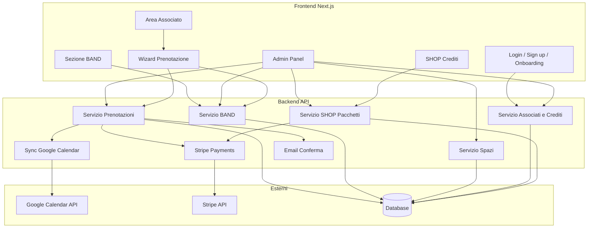

---

## Analisi SuperSaaS attuale (screenshot)

Riferimento visivo del sistema da sostituire. **Non tutto va replicato 1:1** — si importa ciò che è utile (email conferma, PROVI DA SOLO, policy) e si sostituisce ciò che è superato (autodichiarazione quota, UI datata).

### Schermata 5 — Modifica prenotazione (admin SuperSaaS)

| Elemento SuperSaaS | Nel nuovo sistema |
|--------------------|-------------------|
| Date/ora inizio–fine editabili | Admin: sposta, allunga, riduce durata |
| Nome, PROVI DA SOLO | Editabili; band se non solo |
| Servizio (Arancio 2h) | Cambio sala/durata con ricalcolo prezzo |
| **Invia email** checkbox | Opzione invio email su modifica |
| Prezzo €30 | Ricalcolo automatico + saldo differenza |
| **Respingi** | Azione admin → rifiuta / annulla |
| Audit "Creata da amministratore" | `BookingAuditLog` con autore e timestamp |
| Aggiorna / Elimina | Salva modifica / cancella prenotazione |

### Schermata 3 — Nuova prenotazione (form SuperSaaS)

| Elemento SuperSaaS | Nel nuovo sistema |
|--------------------|-------------------|
| Date/ora inizio–fine | Wizard step slot (es. 8 lug, 11:00–13:00) |
| Nome prenotante | Da profilo utente loggato (non campo libero) |
| **Provi da solo?** SI/NO | **Mantenere** come opzione sala (−2€ se SI) |
| **Iscrizione e Quota Associativa** (dropdown autodichiarazione) | **RIMUOVERE** — sostituito da verifica reale + sistema BAND |
| Prezzo calcolato | Mantenere (es. Rossa 2h = €20; Arancio 2h = €30) |
| Crea prenotazione | Wizard → pagamento Stripe/crediti |

### Schermata 4 — Email di conferma (da importare)

Campi utili da replicare nell'email transazionale post-prenotazione:

| Campo email SuperSaaS | Nel nuovo sistema |
|-----------------------|-------------------|
| "La prenotazione è stata creata" | Oggetto email conferma |
| Stato (Approvata / In attesa) | Stato prenotazione |
| ID prenotazione | `booking.id` pubblico |
| **Quando** — data e fascia oraria | `startAt` – `endAt` formattati |
| **Cosa** — MusicPro / Arancio 2h | Nome sala + durata |
| Nome e cognome | Utente prenotante + **nome BAND** |
| **Provi da solo?** | Valore opzione (Sì/No) |
| **Prezzo** | Totale pagato |
| Link modifica prenotazione | Link a `/dashboard/bookings/mine/[id]` |
| Saldo crediti residuo | Saldo post-addebito |
| Policy cancellazione 24h | Testo configurabile (default da SuperSaaS) |
| Link SHOP | `/dashboard/shop` |
| ~~Autodichiarazione quota~~ | **Non incluso** — verifica automatica via BAND |

**Policy cancellazione/modifica associato (default da SuperSaaS email: 24h)** — configurabile separatamente dalle soglie admin (vedi §5).

### Schermata 1 — Disponibilità (prenotazione)

| Elemento SuperSaaS | Dettaglio | Nel nuovo sistema |
|--------------------|-----------|-------------------|
| Titolo | "Prenotazioni MusicPro" | `/dashboard/bookings` |
| Vista dropdown | "Disponibilità" | Tab/vista "Prenota" nella sezione prenotazioni |
| Filtro contesto | **"Disponibilità per Arancio 2h"** | Scelta **sala** + **durata** prima della lista slot |
| Lista slot | Colonne **Da / Fino a**, incrementi **30 min** | Slot con granularità 30 min (configurabile admin) |
| Durata fissa | Esempi: 11:00–13:00, 11:30–13:30 (finestra scorrevole 2h) | Logica sliding window: ogni riga = inizio + durata scelta |
| Azione | Pulsante **"+"** arancione per prenotare | Tap su riga/card slot → avvia wizard (opzioni → pagamento) |
| Ricerca | **"Trova spazio disponibile dopo"** + date picker + **Trova** | Feature **"Prossimo slot libero"** da data/ora scelta |
| Ruolo | "Connesso come amministratore" | Stesso account può essere admin; UI associato separata da `/admin` |

**Spazi noti (da screenshot e conferme):**

| Sala | Tariffa oraria | Note |
|------|----------------|------|
| **Rossa** | **10 €/h** | Confermato |
| **Verde** | **15 €/h** | Confermato |
| **Arancio** | **15 €/h** | Confermato da email (2h = €30) |

Granularità slot default: **30 minuti**. Durata prenotazione esempio: **2 ore**.

### Schermata 2 — Le mie prenotazioni

| Elemento SuperSaaS | Dettaglio | Nel nuovo sistema |
|--------------------|-----------|-------------------|
| Titolo | "Le tue prenotazioni future" | `/dashboard/bookings/mine` |
| Vista dropdown | "Le tue prenotazioni" | Filtro: Future / Storico / Cancellate |
| Link storico | **"Mostra storico"** | Tab o toggle "Storico" nella stessa pagina |
| Empty state | "Non hai prenotazioni future in calendario" | Stato vuoto con CTA "Prenota ora" |
| Footer admin | Cruscotto, Esci, versione desktop | Bottom nav + link admin se ruolo `admin` |

### Cosa migliorare rispetto a SuperSaaS

- UI moderna (dark theme MusicPro, card, bottom nav) al posto del layout salmone/basic
- **Calendario globale** multi-sala (requisito esplicito) **in aggiunta** alla vista lista slot
- Pagamento integrato Stripe/crediti (SuperSaaS non lo mostra in queste schermate)
- Badge visivi per slot "richiede approvazione" (6–12h)
- Opzioni sala nel wizard (PROVI DA SOLO, microfoni, ecc.)
- **Sistema BAND** al posto dell'autodichiarazione quota
- **Email di conferma** strutturata con campi utili da SuperSaaS
- **Onboarding obbligatorio**: iscrizione + quota prima dell'accesso

---

## Accesso, iscrizione e quota (nuovo modello)

> **Implementazione:** Fase 3. In Fase 1 qualsiasi utente registrato può prenotare (per validare il core). Il vincolo quota entra con il sistema BAND.

**SuperSaaS oggi:** dropdown autodichiarazione "Siamo tutti in regola con la quota" / "Uno o più devono iscriversi" / ecc.

**Nuovo modello MusicPro — verifica reale, non autodichiarazione:**

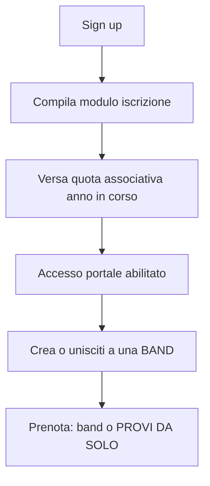

1. **Sign up** → account creato ma accesso limitato.
2. **Modulo iscrizione** compilato (anagrafica, documenti se previsti).
3. **Quota associativa** dell'anno in corso versata (Stripe / SHOP).
4. Solo allora: accesso completo a dashboard, BAND, prenotazioni, SHOP crediti.
5. Middleware + API: `membershipStatus === active` e `membershipYear === currentYear` su ogni route protetta.

Utente senza quota: redirect a pagina onboarding con istruzioni e link pagamento — **nessun accesso al calendario prenotazioni**.

---

## Sistema BAND

### Concetto

Una **BAND** raggruppa più associati sotto un nome (es. "The Rolling Stones Tribute"). La prenotazione è **a nome band** per garantire che tutti i membri che accederanno alla struttura siano iscritti con modulo compilato e quota in corso.

**Eccezione — PROVI DA SOLO:** se l'opzione è **abilitata per quella sala** e l'associato la seleziona, **non serve BAND**. Verifica solo il prenotante. Sconto secondo configurazione admin (es. −2€ placeholder).

### Creazione e gestione band (`/dashboard/bands`)

Qualsiasi membro `active` della band può **prenotare** a nome della band (non solo il founder).

Un utente può appartenere a **più band** contemporaneamente.

| Azione | Chi | Descrizione |
|--------|-----|-------------|
| **Crea band** | Qualsiasi utente in regola | Assegna nome band; diventa founder |
| **Aggiungi membro esistente** | Founder o membro autorizzato | Cerca associato già iscritto → invito ad unirsi |
| **Invita nuovo membro** | Founder o membro autorizzato | Genera **link invito** con flusso guidato |
| **Gestisci membri** | Founder | Vedi stato ogni membro; rimuovi |
| **Prenota** | **Tutti i membri `active`** | Selezione band nel wizard prenotazione |
| **Versa quota per altri** | Prenotante (o founder) | Pagamento unico per più membri della band |
| **Abbandona** | Membro | Esce dalla band |

**Stati membro band:**

| Stato | Significato |
|-------|-------------|
| `pending_invite` | Link inviato, non ancora registrato |
| `pending_quota` | Registrato, quota non versata |
| `active` | Iscritto + quota anno in corso |
| `expired` | Quota scaduta |

### Flusso invito (sequenza pagine obbligatoria)

Il link invito (`/invite/[token]`) guida l'utente in **sequenza corretta** di pagine. Serve uno **smoke test E2E** per validare l'intero percorso.

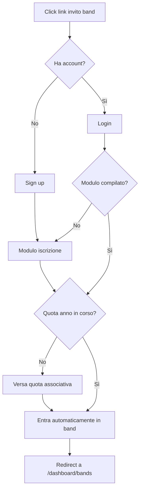

**Pagine coinvolte:** `/invite/[token]` → `/signup` o `/login` → `/onboarding/form` → `/onboarding/quota` → join band API → `/dashboard/bands/[id]`.

- Token monouso o con scadenza; associato alla band e all'email invitata.
- Se l'utente è già in regola: salta form/quota e unisce direttamente alla band.
- **Smoke test** (Fase 2b): script o test Playwright che percorre invito → signup → form → quota → join → verifica membro `active` in band.

### Quota associativa — verifica e versamento per conto altrui

**Regola:** per prenotare, **tutti i membri della band** (non solo il prenotante) devono essere in regola con quota anno in corso. Anche chi non prenota ma partecipa alla sessione deve risultare coperto.

Se uno o più membri non hanno quota versata:

1. Il wizard mostra elenco membri **non in regola** prima di procedere.
2. Il **prenotante** (o founder) può **versare la quota per conto degli altri** in un **unico pagamento Stripe**.
3. Il backend **riconcilia** il pagamento unico in **N movimenti individuali** — uno per ogni membro beneficiario.

**Riconciliazione quota (obbligatoria):**

| Record | Descrizione |
|--------|-------------|
| `QuotaPayment` | Pagamento Stripe (importo totale, `paidByUserId`, stripePaymentId) |
| `QuotaPaymentItem` | Riga per ogni membro: `userId`, `amount`, `membershipYear`, `status` |

- Ogni `QuotaPaymentItem` aggiorna `MemberProfile.membershipStatus` e `membershipUntil` del singolo utente.
- Admin vede: chi ha pagato, per chi, anno, importo — audit trail completo.
- Un membro può aver pagato per sé o essere stato coperto da un altro (campo `paidByUserId` su item).

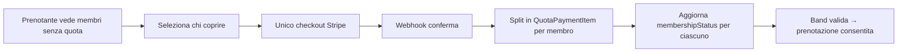

### Prenotazione vincolata a BAND (con eccezione PROVI DA SOLO)

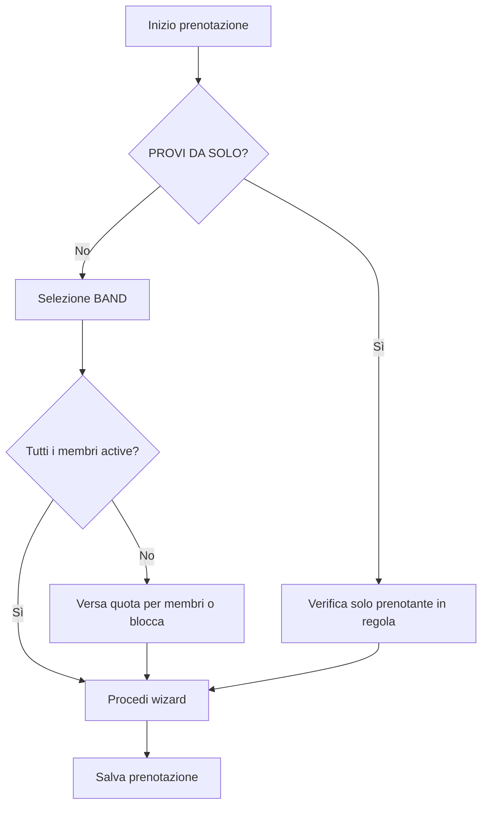

| Modalità | BAND richiesta | Verifica quota |
|----------|----------------|----------------|
| **Con band** (default) | **Sì** — selezione obbligatoria | Tutti i membri della band |
| **PROVI DA SOLO** | **No** — `bandId` null | Solo il prenotante |

- **Con band:** step obbligatorio selezione BAND; qualsiasi membro `active` può prenotare; snapshot `memberIds` sulla prenotazione.
- **PROVI DA SOLO:** salta step BAND; `bandId = null`; `proviDaSolo = true`; sconto −2€; solo `bookedByUserId` deve essere in regola.
- Admin vede band associata solo su prenotazioni non-solo.

### Cosa NON si fa (differenza da SuperSaaS)

- ~~Dropdown "Iscrizione e Quota Associativa"~~ con autodichiarazione
- ~~"Siamo tutti in regola"~~ scelto manualmente dall'utente
- La conformità è **verificata dal sistema** via stato iscrizione + quota + composizione band

---

## Requisiti raccolti (Frontend / Associato)

### 1. Autenticazione, onboarding e accesso

- **Login** per chi ha già un account, **Sign up** per nuovi utenti.
- **Solo utenti registrati** con **modulo iscrizione compilato** e **quota associativa anno in corso versata** accedono all'area riservata.
- Flusso onboarding guidato post-signup fino a completamento requisiti.
- Route protette: non autenticati → `/login`; autenticati senza quota → `/onboarding`.

### 2. Vincolo quota e band

- Accesso al portale solo se **quota in regola** (verifica sistema).
- **Prenotazione con band:** selezione BAND obbligatoria; tutti i membri devono essere in regola.
- **Prenotazione PROVI DA SOLO:** nessuna BAND; solo il prenotante deve essere in regola.

### 3. Flusso prenotazione self-service (wizard a step)

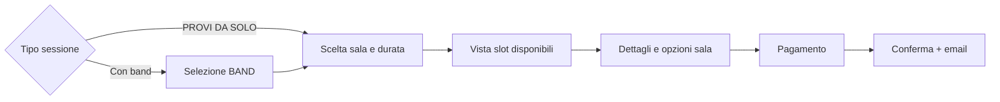

**Step 0 — Tipo sessione** (biforcazione, se consentito dallo slot)
- Opzione **Provi da solo** visibile solo se: sala con `proviDaSoloEnabled` **e** slot dentro **orari PROVI DA SOLO** configurati.
- **Con la mia band** → sempre disponibile (se quota/band OK).
- **Provo da solo** → salta BAND; sconto secondo config sala.

**Step 1 — Selezione BAND** (solo se non PROVI DA SOLO)
- Scelta band tra quelle di cui l'utente è membro (può essere in **più band**).
- Solo band con tutti i membri in regola sono prenotabili; altrimenti CTA "Versa quota per membri" o "Invita/completa iscrizione".
- Qualsiasi membro `active` può prenotare per la band.

**Step 2 — Sala e durata**
- Selezione **spazio** (es. Rossa, Verde, Arancio) e **durata** in ore (es. 2h).
- Opzionale: **"Trova prossimo slot libero"** da data/ora (equivalente "Trova spazio disponibile dopo" SuperSaaS).
- Granularità slot default: **30 minuti** (configurabile admin per spazio).

**Step 3 — Slot disponibili**
- Lista o calendario con finestre scorrevoli: ogni opzione = `inizio` + `inizio + durata`.
- Esempio durata 2h: 11:00–13:00, 11:30–13:30, 12:00–14:00…
- Esclude slot occupati, fuori orario apertura/chiusura, sotto soglia minima anticipo.
- Slot nella fascia 6–12h: badge **"Richiede approvazione"**.
- Tap su slot → step successivo.

**Step 4 — Dettagli e opzioni**
- Se **non** già scelto a step 0: toggle **PROVI DA SOLO** (solo se la sala lo prevede).
- Se PROVI DA SOLO attivo a step 0: opzione già impostata, mostrare badge sconto −2€.
- Microfoni, servizi aggiuntivi, altre opzioni per spazio.
- Riepilogo: tipo (band / solo), band se presente, sala, orario, durata, prezzo.

**Step 5 — Pagamento**
- Scelta metodo di pagamento:
  - **Crediti** (se saldo sufficiente)
  - **Stripe** (carta)
- Conferma e creazione prenotazione.

**Step 6 — Post-prenotazione**
- Schermata conferma + **email** (campi band omessi se PROVI DA SOLO).
- Prenotazione visibile in "Le mie prenotazioni".
- Sync Google Calendar dello spazio (se confermata).

**Due modalità di accesso agli slot (step 2):**

| Modalità | Descrizione |
|----------|-------------|
| **Calendario globale** | Vista multi-sala; tap su cella libera → pre-compila sala + orario |
| **Lista disponibilità** | Scelta sala + durata → lista "Da / Fino a" con incrementi 30 min |

### 4. Sezione BAND (`/dashboard/bands`)

- Lista band dell'utente (membro o founder).
- Crea band, gestisci membri, invia link invito.
- Stato visivo conformità membri (verde = OK, rosso = azione richiesta).

### 5. Le mie prenotazioni

Equivalente SuperSaaS "Le tue prenotazioni future" + "Mostra storico":

| Vista | Contenuto |
|-------|-----------|
| **Future** | Prenotazioni confermate e in attesa approvazione, ordinate per data |
| **Storico** | Prenotazioni passate |
| **Cancellate** | Prenotazioni annullate (opzionale, può essere tab nello storico) |

- **Empty state**: "Non hai prenotazioni future" + CTA "Prenota ora" (come SuperSaaS ma con design moderno).
- Card per ogni prenotazione: **band**, sala, data/ora, durata, PROVI DA SOLO, stato, cancella (se ≥24h prima, default).

### 6. Area associato aggiuntiva

- **Saldo crediti** visibile in dashboard/profilo.
- Link a **SHOP** per acquisto pacchetti crediti.

### 7. UI/UX — Mobile-first (requisito trasversale)

Il frontend deve essere **rigorosamente funzionale, ergonomico e moderno su mobile**. Il telefono è il dispositivo primario per prenotare; desktop è secondario ma deve restare pienamente utilizzabile.

**Principi**
- **Mobile-first**: progettare e implementare prima per viewport piccoli (320–428px), poi adattare a tablet/desktop.
- **Funzionale**: ogni schermata ha un obiettivo chiaro; niente elementi decorativi che ostacolano l'azione principale.
- **Ergonomico**: target touch ≥ 44×44px, spaziatura generosa, testi leggibili senza zoom, form e CTA raggiungibili con il pollice.
- **Moderno**: UI pulita, coerente con il design system esistente (dark theme, Tailwind, Lucide), transizioni leggere, feedback immediato su ogni azione.

**Pattern UI per schermata**

| Schermata | Comportamento mobile |
|-----------|---------------------|
| Login / Sign up | Form a colonna singola, input grandi, tastiera ottimizzata (`email`, `tel`) |
| Calendario globale | Vista multi-sala; oppure lista "Da/Fino a" stile SuperSaaS; swipe tra giorni |
| Lista disponibilità | Righe touch con orario inizio–fine; pulsante "+" sostituito da tap su card |
| Trova prossimo slot | Date/time picker + CTA "Trova" in fondo lista |
| Le mie prenotazioni | Tab Future/Storico; empty state con CTA "Prenota ora"; card scrollabili |
| BAND | Card band, lista membri con stato, invio link, CTA crea band |
| Wizard prenotazione | Step 0: band vs PROVI DA SOLO → [band] → sala → slot → opzioni → pagamento |
| Opzioni sala | Checkbox/toggle grandi, stepper microfoni, riepilogo prezzo sticky |
| Pagamento | Card selezionabili; Stripe Checkout mobile-native |
| SHOP | Card pacchetti verticali, prezzo e risparmio evidenti |
| Dashboard / Sidebar | **Bottom navigation** o drawer hamburger su mobile (la sidebar fissa desktop non va bene su phone) |

**Requisiti tecnici**
- Layout responsive con breakpoint Tailwind (`sm`, `md`, `lg`); nessun overflow orizzontale.
- Componenti touch-friendly: niente hover-only per azioni critiche.
- Stati loading, errore e vuoto espliciti su ogni vista.
- Test manuale su viewport 375px (iPhone) e 390px (Android) come criterio di accettazione UI.
- Admin panel: responsive ma priorità minore rispetto al flusso associato (può usare layout tablet+ con menu collassabile).

**Non obiettivi**
- Nessuna app nativa iOS/Android in questa fase (solo web responsive/PWA opzionale in futuro).

---

## Sistema SHOP e Crediti

### Concetto

- I **crediti** sono la valuta interna per pagare le prenotazioni a prezzo scontato rispetto al pagamento diretto Stripe.
- Dalla sezione dedicata **SHOP** (`/dashboard/shop` o simile) l'associato acquista **pacchetti di crediti** a prezzo scontato.
- I **pacchetti crediti** sono **configurati dall'admin** (non hardcoded).

### Configurazione admin pacchetti crediti

Per ogni pacchetto l'admin definisce (proposta):

| Campo | Esempio |
|-------|---------|
| Nome | "Pacchetto 10 ore" |
| Crediti inclusi | 10 |
| Prezzo | €80 (sconto vs €10/h × 10 = €100) |
| Stato | Attivo / disabilitato |
| Ordine visualizzazione | 1, 2, 3… |

### Flusso acquisto crediti (associato)

1. Associato visita SHOP → vede pacchetti attivi.
2. Seleziona pacchetto → pagamento **Stripe**.
3. Webhook Stripe conferma pagamento → accredito crediti su ledger associato.
4. Saldo aggiornato immediatamente in UI.

### Equivalenza crediti (confermato)

- **1 credito = 1 ora di sala** (rapporto **1:1** con la durata prenotata).
- Il costo in crediti segue la tariffa oraria: es. Rossa 2h = **2 crediti** (tariffa 10€/h → 20€ equivalente se pagato in crediti al valore nominale).
- I crediti **non scadono**.

### Uso crediti in prenotazione

1. A step pagamento, se saldo ≥ costo in crediti → opzione "Paga con crediti".
2. Prenotazione **confermata subito** (≥ soglia auto): addebito atomico crediti + creazione `confirmed`.
3. Prenotazione **`pending_approval`** (fascia 6–12h): **hold crediti** (non addebito definitivo) fino ad approvazione admin → vedi § Pagamento con approvazione.
4. Se saldo insufficiente → Stripe o invito ad acquistare pacchetto SHOP.

### Penali su cancellazione (configurabili admin)

L'admin configura in **Admin → Impostazioni → Penali** una o più **fasce orarie** con percentuale di penale. Esempio:

| Fascia (ore prima dell'evento) | Penale default esempio |
|--------------------------------|------------------------|
| Tra 24h e 12h | **50%** del valore (crediti trattenuti o non rimborsati) |
| Tra 12h e 6h | 75% (esempio, editabile) |
| Sotto 6h | 100% (nessun rimborso, se cancellazione consentita) |

**Configurazione admin per ogni regola:**

| Campo | Descrizione |
|-------|-------------|
| `fromHours` | Limite superiore fascia (es. 24) |
| `toHours` | Limite inferiore fascia (es. 12) |
| `penaltyPercent` | Penale % (es. 50) |
| `enabled` | Attiva/disattiva |

- Alla cancellazione associato: calcolo penale in base alla fascia; rimborso = totale − penale.
- Rimborso residuo: crediti o metodo originale (policy associato TBD; admin override sempre disponibile).
- Admin può aggiungere/rimuovere/modificare fasce e percentuali.

### Distinzione concetti sconto

| Tipo | Dove si configura | Cosa fa |
|------|-------------------|---------|
| **Pacchetti crediti SHOP** | Admin → SHOP | Acquisto anticipato crediti scontati |
| **Sconti a pacchetto prenotazione** | Admin → Spazio | Sconto su durata singola prenotazione (es. 5h −10%) |
| **PROVI DA SOLO** | Admin → Config sala | Flag + orari dedicati per sala (vedi sotto) |

### PROVI DA SOLO — configurazione per sala (Admin → Spazi → [sala])

**PROVI DA SOLO** è un **flag nella pagina di configurazione della sala**, non un'opzione generica del wizard. Per ogni spazio l'admin configura:

#### Flag e promo (pagina configurazione sala)

| Campo | Descrizione |
|-------|-------------|
| **`proviDaSoloEnabled`** | Flag on/off — abilita la modalità per questa sala |
| Tipo sconto | Fisso € / % (promo da definire) |
| Valore sconto | Es. 2 (placeholder −2€) |
| Etichetta UI | "Provi da solo?" |
| Esclude BAND | Se flag attivo + scelta associato → nessuna BAND richiesta |

#### Orari PROVI DA SOLO (per ogni sala)

Oltre al flag, l'admin configura **fasce orarie** in cui PROVI DA SOLO è disponibile — analoghe agli orari di apertura ma dedicate:

| Giorno | Dalle | Alle | Attivo |
|--------|-------|------|--------|
| Lunedì | 09:00 | 14:00 | ☑ |
| Martedì | — | — | ☐ |
| … | … | … | … |

- Struttura dati: `ProviDaSoloSchedule` (per `spaceId`: `dayOfWeek`, `startTime`, `endTime`, `enabled`).
- **Fuori fascia PROVI DA SOLO:** l'opzione non è selezionabile nel wizard (solo prenotazione con BAND).
- **Dentro fascia + flag attivo:** associato può scegliere "Provo da solo" → salta BAND, applica sconto configurato.
- Validazione server-side: rifiuto `proviDaSolo=true` se slot fuori orari PROVI DA SOLO della sala.

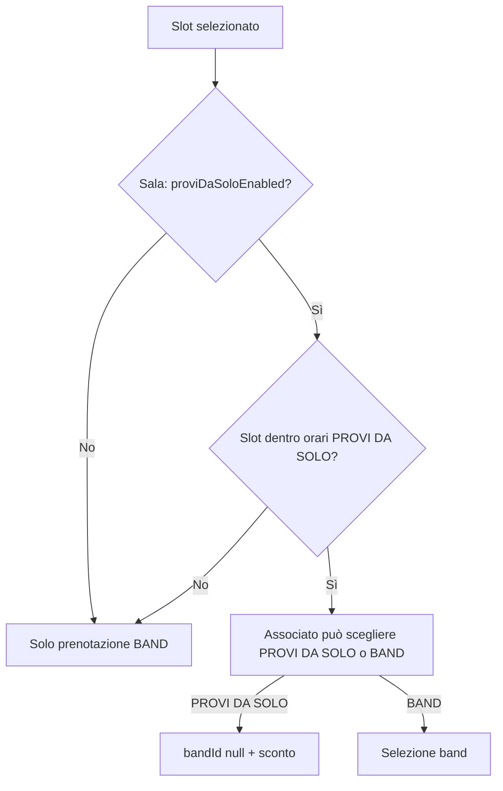

- Promo commerciale (€, %, testi) **da definire più avanti**; architettura e UI admin già previste.
- Admin configura indipendentemente per Rossa, Verde, Arancio.

---

## Pagamento e approvazione admin

### Flusso pagamento per fascia oraria

| Anticipo | Stato prenotazione | Pagamento |
|----------|-------------------|-----------|
| **≥ 12h** (auto) | `confirmed` immediato | **Addebito subito** (crediti o Stripe) |
| **6–12h** (approvazione) | `pending_approval` | **Preautorizzazione** — addebito **solo dopo approvazione admin** |
| **< 6h** | Non creata | — |

### Preautorizzazione (fascia approvazione)

Per prenotazioni nella fascia che richiede approvazione admin:

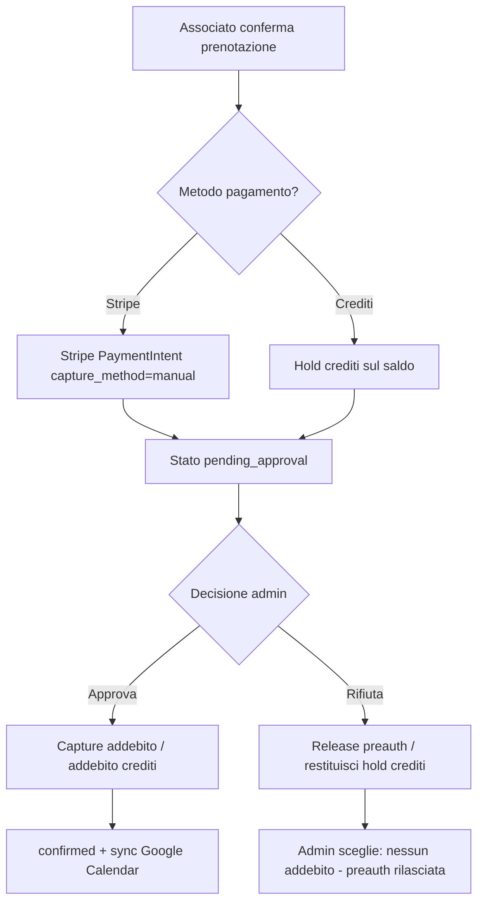

**Stripe:** `PaymentIntent` con `capture_method: manual` → preautorizzazione alla richiesta → `capture()` all'approvazione → `cancel()` al rifiuto (nessun addebito).

**Crediti:** hold temporaneo sul saldo (crediti riservati, non spendibili) → addebito definitivo all'approvazione → release hold al rifiuto.

### Rifiuto prenotazione da admin

- **Rimborso automatico** della preautorizzazione (Stripe cancel / release hold crediti).
- Nessun addebito all'associato.
- Admin può aggiungere nota motivo rifiuto.
- Email notifica all'associato.

### Pagamento immediato vs differito (riepilogo)

- **Non si addebita mai** una prenotazione `pending_approval` prima dell'OK admin.
- Solo dopo **Approva** → capture/addebito → `confirmed`.

---

## Requisiti raccolti (Admin / Backend)

### 1. Gestione prenotazioni

L'admin deve poter:
- Visualizzare e gestire tutte le prenotazioni.
- Scegliere tra **viste multiple**:
  - **Calendario interattivo** — eventi cliccabili (vista primaria per edit).
  - **Lista cronologica** — dalle prossime alle più lontane.
  - **Storico** — prenotazioni passate.
  - **Cancellazioni** — prenotazioni annullate (con motivo/data).
  - **Da approvare** — prenotazioni in attesa di conferma.

#### Calendario admin con edit completo

- Vista calendario (`/admin/bookings/calendar`) con eventi **cliccabili** per spazio o aggregato.
- Click su evento → pannello/drawer **Modifica prenotazione** (equivalente SuperSaaS, UI moderna).
- **Azioni edit complete:**
  - **Spostare** — cambio data/ora inizio (drag o form).
  - **Allungare / ridurre** — modifica durata (ore).
  - **Cambiare sala** — altro spazio con ricalcolo tariffa.
  - **Annullare** — con scelta metodo rimborso (vedi sotto).
  - Modificare opzioni (PROVI DA SOLO, microfoni, ecc.).
  - **Respingi** — per prenotazioni `pending_approval`.
  - Checkbox **Invia email** notifica modifica all'associato.
- Audit trail: chi ha creato/modificato, quando, ID prenotazione.

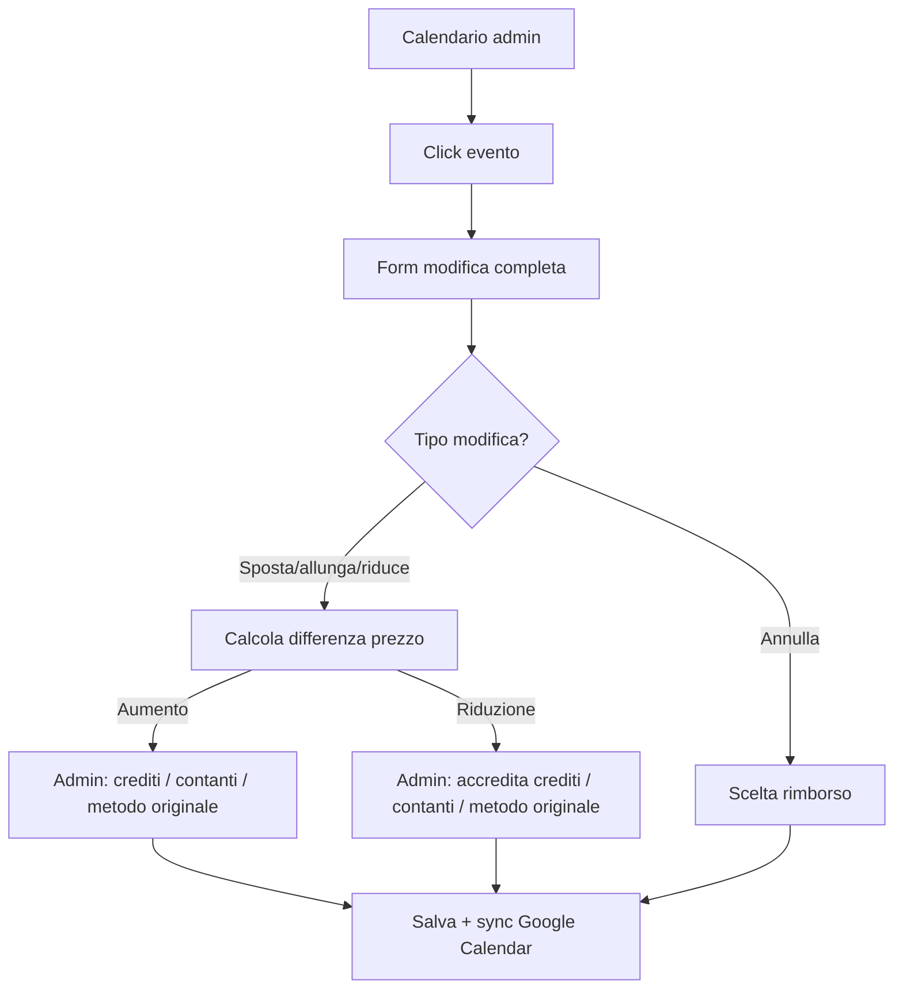

#### Saldare differenze di prezzo (modifica admin)

Quando una modifica cambia il totale (più ore o meno ore), l'admin sceglie come saldare:

| Scenario | Opzioni admin |
|----------|---------------|
| **Aumento prezzo** (allunga, sala più cara) | Addebito: **crediti** / **contanti** / **metodo originale** (Stripe) |
| **Riduzione prezzo** (accorcia, sala meno cara) | Rimborso: **crediti** / **contanti** / **metodo originale** |

- Ogni operazione registrata in `BookingAdjustment` (importo, metodo, direzione, adminId).
- Aggiornamento ledger crediti o rimborso Stripe se metodo originale.

#### Annullamento admin

All'annullamento l'admin sceglie il rimborso:
- **Trasforma in crediti** — accredito sul ledger associato.
- **Riaccredita sul metodo originale** — rimborso Stripe o segna contanti restituiti.

### 4. Regole modifica e annullamento (configurabili admin)

L'admin configura in **Admin → Impostazioni** le soglie temporali per modifica e annullamento. Tutte le soglie sono **editabili** (non hardcoded).

| Campo | Default esempio | Descrizione |
|-------|-----------------|-------------|
| `modifyMinHours` | 6 | Ore mancanti all'evento: **sotto questa soglia la prenotazione non è modificabile** (associato) |
| `cancelMinHours` | 6 | Ore mancanti all'evento: **sotto questa soglia non è annullabile** (associato) |
| `associateModifyEnabled` | true | Permetti modifiche self-service associato |
| `associateCancelEnabled` | true | Permetti cancellazioni self-service associato |

**Comportamento:**

| Attore | Modifica | Annullamento |
|--------|----------|--------------|
| **Associato** | Consentita se ≥ `modifyMinHours` | Consentita se ≥ `cancelMinHours`; rimborso − **penale** secondo fasce configurate (§ Penali) |
| **Admin** | **Sempre** dal calendario (override soglie); saldo differenza a scelta | **Sempre**; sceglie crediti o metodo originale |

Esempio: con `modifyMinHours = 6`, un associato non può modificare a meno di 6 ore dall'evento; l'admin può comunque aprire l'evento dal calendario e modificare.

#### Penali cancellazione (configurazione admin)

L'admin definisce **fasce orarie** con percentuale penale (CRUD in Impostazioni). Struttura dati `CancellationPenaltyRule`:

| Campo | Esempio |
|-------|---------|
| `fromHours` | 24 |
| `toHours` | 12 |
| `penaltyPercent` | 50 |
| `sortOrder` | 1 |

Esempio operativo: cancellazione tra 24h e 12h dall'evento → penale **50%** (su crediti o importo rimborsabile).

### 2. Gestione associati, band, anagrafiche e crediti

L'admin deve poter:
- Gestire **anagrafiche associati** (dati personali, contatti, stato iscrizione, modulo).
- Gestire **band** (nome, membri, stato conformità, founder).
- Gestire **crediti associati** (saldo, movimenti, acquisti da SHOP, addebiti prenotazione).
- **Configurare pacchetti crediti SHOP** (CRUD pacchetti, prezzi, attivazione).
- Collegare prenotazioni a **band** e utente prenotante.

### 3. Gestione spazi (sale prova)

L'admin può **aggiungere/rimuovere** spazi affittabili. **Ogni sala ha una pagina di configurazione dedicata** (`/admin/spaces/[id]`) — non si gestisce solo via seed SQL.

**Valori iniziali di riferimento (SuperSaaS):**

| Sala | Tariffa oraria default |
|------|------------------------|
| Rossa | 10 €/h |
| Verde | 15 €/h |
| Arancio | 15 €/h |

La segreteria imposta e modifica tutto da admin; il seed `Sala 1`–`4` attuale è solo placeholder fino alla prima configurazione.

**Pagina config sala — sezioni:**

| Sezione | Contenuto configurabile |
|---------|-------------------------|
| Anagrafica | Nome, slug, descrizione, capacità, abilitata/disabilitata |
| Tariffa | Prezzo base €/ora |
| Orari | Apertura/chiusura per giorno della settimana |
| Slot e durata | Granularità (default 30 min), durata min/max, incrementi |
| Sconti per durata | Fasce ore prenotate → sconto % o € (es. 5h −10%) |
| PROVI DA SOLO | Flag, orari dedicati, tipo/valore sconto |
| Opzioni | Microfoni, attrezzature, addon (nome, prezzo, abilitata) |
| Pacchetti sala | Sconti a pacchetto legati allo spazio (se distinti da SHOP crediti) |
| Calendari | Publish Google Calendar + import calendari esterni aula (Fase 2) |

Per ogni spazio, configurazione completa (dettaglio campi legacy piano):

| Campo | Descrizione |
|-------|-------------|
| Nome | Es. **Rossa**, **Verde**, **Arancio** |
| **Orari apertura/chiusura** | Per ogni giorno della settimana: ora apertura, ora chiusura, chiuso tutto il giorno |
| Eccezioni calendario | Giorni festivi, chiusure straordinarie, aperture speciali (opzionale fase 1+) |
| Disponibilità slot | Granularità default **30 min**; durata min/max prenotazione (es. 2h) |
| Tariffa oraria | Prezzo base €/ora |
| Sconti a pacchetto | Es. 5 ore −10%, 10 ore −15% (struttura TBD) |
| Stato | Abilitato / disabilitato |
| Opzioni configurabili | Microfoni, attrezzature aggiuntive, altre opzioni |
| **PROVI DA SOLO** | **Flag** + **orari dedicati** (sezione separata in config sala) |
| **Calendari esterni** | Uno o più Google Calendar pubblici (aule scuola) che bloccano disponibilità |

Ogni opzione dovrebbe supportare almeno: nome, descrizione, prezzo/sconto, abilitata/disabilitata.

**Orari apertura/chiusura (dettaglio)**

L'admin configura per ogni spazio una griglia settimanale:

| Giorno | Apertura | Chiusura | Chiuso |
|--------|----------|----------|--------|
| Lunedì | 09:00 | 23:00 | ☐ |
| Martedì | 09:00 | 23:00 | ☐ |
| … | … | … | … |
| Domenica | — | — | ☑ |

- Solo gli slot compresi tra apertura e chiusura sono prenotabili nel calendario.
- Fuori orario: slot non selezionabili (grigi nel calendario associato).
- Validazione server-side: rifiuto prenotazioni fuori fascia.

### 5. Regole limiti nuova prenotazione (anticipo)

L'admin può **configurare e modificare** le soglie di anticipo minimo per l'accettazione delle prenotazioni. Configurazione in **Admin → Impostazioni** (globale, con possibile override per spazio in fase successiva).

**Regola di default (esempio fornito):**

| Anticipo rispetto all'inizio evento | Esito |
|-------------------------------------|-------|
| **≥ 12 ore** | Accettata **automaticamente** (dopo pagamento) → stato `confirmed` |
| **Tra 12 e 6 ore** | Richiede **approvazione admin** → stato `pending_approval` |
| **< 6 ore** | **Non accettata** (blocco in UI + rifiuto API) |

Le soglie **12h** e **6h** sono **editabili dall'admin** (non hardcoded).

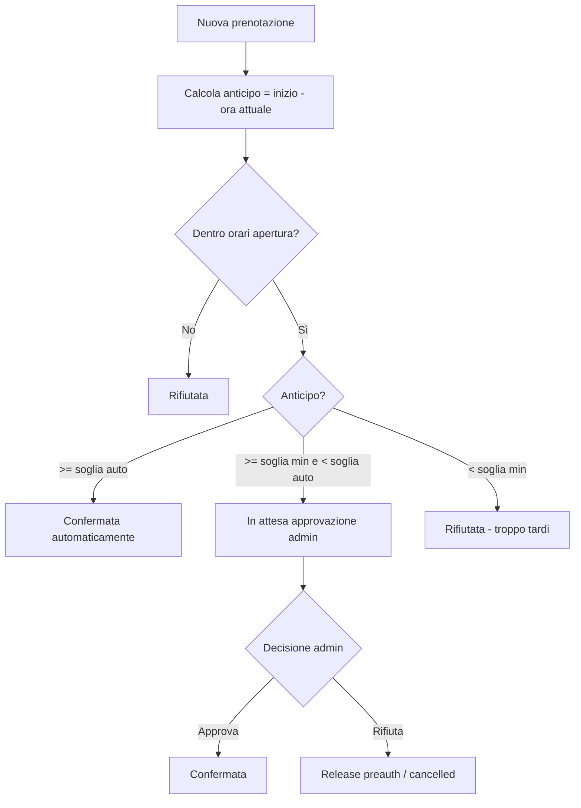

**Campi configurabili (Admin → Impostazioni):**

| Campo | Default | Descrizione |
|-------|---------|-------------|
| `autoConfirmMinHours` | 12 | Ore minime di anticipo per conferma automatica |
| `approvalMinHours` | 6 | Ore minime di anticipo per permettere richiesta con approvazione |
| Sotto `approvalMinHours` | — | Nuova prenotazione non permessa |

*Nota: `modifyMinHours` e `cancelMinHours` (§4) regolano modifica/annullamento prenotazioni esistenti; le soglie sopra regolano solo **nuove** prenotazioni.*

**Comportamento associato**
- Prenotazione ≥ soglia auto: addebito immediato → messaggio "Prenotazione confermata".
- Prenotazione tra le due soglie: **preautorizzazione** (Stripe hold / hold crediti) → `pending_approval` → messaggio "Richiesta inviata, in attesa di approvazione". **Nessun addebito fino ad approvazione.**
- Prenotazione < soglia min: slot non selezionabile.

**Comportamento admin**
- Vista **Da approvare**: prenotazioni con pagamento preautorizzato in attesa.
- **Approva** → capture Stripe / addebito crediti → `confirmed` + sync Google Calendar.
- **Rifiuta** → cancel preauth / release hold crediti → `cancelled` (nessun addebito).

### 6. Integrazione Google Calendar (doppia direzione)

Per ogni sala, **due flussi calendario distinti**:

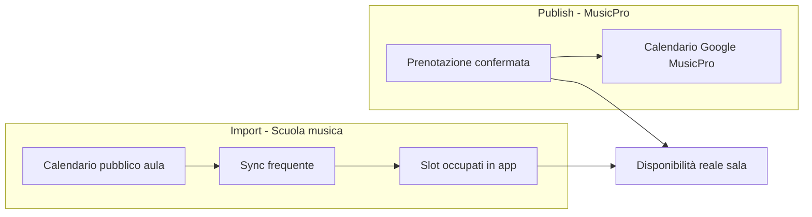

#### A) Publish — prenotazioni MusicPro → Google

- **Un calendario Google dedicato per ogni spazio** sull'account `musicproeventi@gmail.com`.
- Su prenotazione confermata/modificata/cancellata: `events.insert/update/delete`.
- OAuth 2.0 con refresh token (setup una tantum).

#### B) Import — calendari esterni scuola di musica (aula → sala)

Le sale sono usate anche come **aule** dalla scuola di musica (app esterna). Ogni aula ha un **Google Calendar pubblico** che occupa la sala durante le lezioni.

L'**admin può aggiungere uno o più calendari esterni** per ogni spazio:

| Campo configurazione | Descrizione |
|---------------------|-------------|
| Nome | Es. "Aula scuola - Arancio" |
| URL / Calendar ID | Link al calendario Google pubblico dell'aula |
| Spazio collegato | Rossa / Verde / Arancio |
| Stato | Attivo / disabilitato |
| Intervallo sync | Frequenza aggiornamento (es. ogni 5–15 min, configurabile) |

**Comportamento sync:**
1. Admin incolla URL calendario pubblico Google (o calendar ID).
2. Il sistema **salva** il riferimento e **importa** gli eventi (iCal feed o Google Calendar API su calendario pubblico).
3. **Aggiornamento frequente** (cron job / background worker): re-import periodico per riflettere la situazione reale.
4. Gli eventi importati **bloccano gli slot** nel calendario disponibilità (associato e admin).
5. Cache locale `ExternalCalendarEvent` con `lastSyncedAt` per performance.

**Disponibilità effettiva di uno slot:**

```
libero = dentro orari apertura
       AND NON occupato da prenotazione MusicPro
       AND NON occupato da evento calendario esterno (aula scuola)
```

- UI: slot esterni mostrati come **occupati** (es. grigio con etichetta "Aula scuola" o simile).
- Validazione server-side: rifiuto prenotazioni su slot bloccati da calendario esterno.
- Admin vede ultimo sync, errori sync, numero eventi importati per calendario.

**Nota:** i calendari esterni sono **sola lettura** — MusicPro non scrive su di essi. Le prenotazioni associati vanno solo sul calendario publish (A).

---

## Architettura proposta

### Stack tecnico — MusicPro School (decisione effettiva)

> Il piano originale proponeva Prisma + NextAuth partendo da zero. **In questo repo lo stack è già scelto:**

| Componente | Implementazione attuale | Estensioni previste dal piano |
|------------|-------------------------|-------------------------------|
| Database | **Supabase PostgreSQL** — `supabase/migrations/` | Tabelle BAND, crediti, calendari esterni (Fase 2–3) |
| Data access | **`@musicpro/database`** (Supabase JS client + RPC) | Nuovi moduli per pricing, GCal, SHOP |
| Auth | **Supabase Auth** + `members.user_id` + `member_roles` | Onboarding quota (già parziale via iscrizione) |
| API | RPC `create_booking_safe()` + RLS; Edge Functions per Stripe | Route Handlers Next.js dove serve |
| Realtime | **Supabase Realtime** su `bookings` | Già attivo |
| Google Calendar | — | OAuth publish + import iCal (Fase 1–2) |
| Sync esterno | — | Cron Vercel / Edge Function (Fase 2) |
| Pagamenti | Stripe per **iscrizioni** (GAS→Supabase in corso) | Stripe Checkout sale + webhook (Fase 1) |
| UI Admin | `/admin/*` (associati, rimborsi) | `/admin/bookings/*`, `/admin/spaces/*` |
| UI Associato | `/prenotazioni`, `/dashboard`; mobile Expo | Wizard, `/dashboard/bookings/mine`, SHOP |
| Email | GAS legacy / da migrare | Resend/SendGrid conferma prenotazione (Fase 2) |
| Mobile | **Expo app** (`musicpro/apps/mobile`) | Allineare UX al piano mobile-first |

| UI mobile | **Expo + web responsive** | Piano originale: solo web responsive; qui serve **entrambi** |

Prisma, NextAuth e path `src/` del repo errato **non si adottano**. Eventuali integrazioni (Google Calendar, cron sync calendari esterni) si aggiungono **sopra** Supabase (Edge Functions, Vercel cron, Route Handlers), senza cambiare stack.

### Modello dati (bozza)

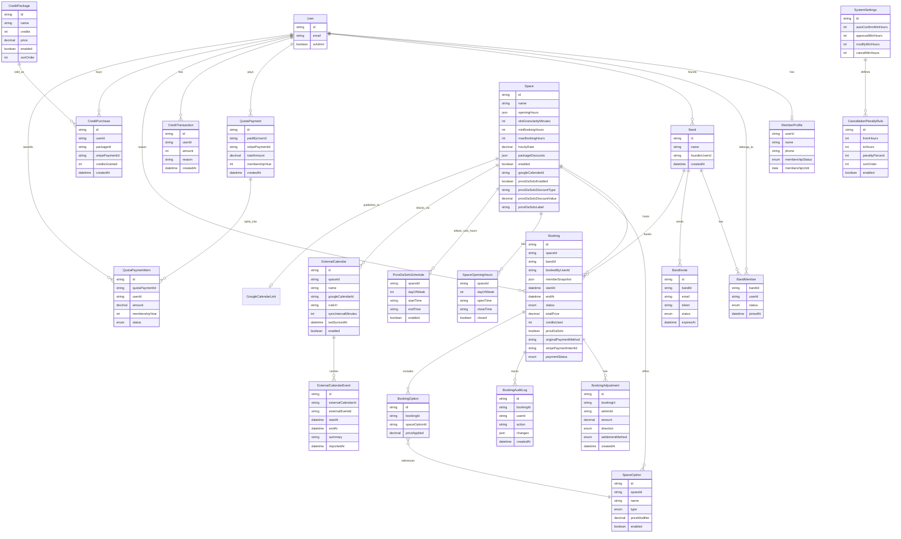

`bandId` **nullable** — `null` quando `proviDaSolo === true`.

**PaymentStatus:** `pending` | `preauthorized` | `captured` | `released` | `refunded`

**Stati prenotazione:** `pending_approval` | `confirmed` | `cancelled` | `rejected` | `completed` | `no_show`

**Transizioni stato (in base ad anticipo):**
- Pagamento ok + anticipo ≥ `autoConfirmMinHours` → `confirmed`
- Pagamento ok + anticipo tra soglie → `pending_approval`
- Admin approva → `confirmed`; admin rifiuta → `cancelled` o `rejected`
- Anticipo < `approvalMinHours` → non creata / `rejected`

**SettlementMethod:** `credits` | `cash` | `original_method`

**Tipi opzione (proposta):** `addon` (costo extra) | `discount` (es. PROVI DA SOLO −2€)

### Struttura cartelle prevista

```
src/
├── app/
│   ├── login/                    # Login esistente → estendere
│   ├── signup/
│   ├── invite/
│   │   └── [token]/page.tsx      # Entry point flusso invito band
│   ├── onboarding/
│   ├── admin/
│   │   ├── layout.tsx
│   │   ├── page.tsx
│   │   ├── bookings/
│   │   │   ├── calendar/page.tsx
│   │   │   └── [id]/edit/page.tsx
│   │   ├── spaces/
│   │   │   ├── [id]/page.tsx           # Config sala: flag PROVI DA SOLO + orari
│   │   │   └── [id]/external-calendars/
│   │   ├── members/
│   │   ├── bands/
│   │   ├── credit-packages/
│   │   └── settings/
│   ├── dashboard/
│   │   ├── bands/                # CRUD band, membri, inviti
│   │   ├── bookings/
│   │   │   ├── page.tsx
│   │   │   ├── new/page.tsx      # Wizard: band → sala → slot → opzioni → pagamento
│   │   │   └── mine/page.tsx
│   │   └── shop/
│   └── api/
│       ├── auth/
│       ├── bands/
│       ├── band-invites/
│       ├── quota-payments/       # Versamento quota singolo e multiplo
│       ├── bookings/
│       ├── spaces/
│       ├── members/
│       ├── credits/
│       ├── credit-packages/
│       ├── shop/
│       ├── stripe/webhook/
│       ├── calendar/
│       ├── external-calendars/   # CRUD + trigger sync
│       └── cron/sync-calendars/  # Job sync frequente
├── components/
│   ├── admin/
│   │   ├── AdminCalendar.tsx
│   │   ├── BookingEditDrawer.tsx
│   │   └── SettlementMethodPicker.tsx
│   ├── layout/
│   │   ├── MobileBottomNav.tsx   # Nav principale su mobile
│   │   └── MobileDrawer.tsx      # Menu drawer alternativo
│   ├── band/
│   ├── booking/
│   │   ├── GlobalCalendar.tsx    # Vista multi-sala
│   │   ├── AvailabilityList.tsx  # Lista Da/Fino a stile SuperSaaS
│   │   ├── FindNextSlot.tsx      # Trova prossimo slot libero
│   │   ├── BookingWizard.tsx
│   │   ├── SpaceOptionsForm.tsx
│   │   └── PaymentStep.tsx
│   └── shop/
├── lib/
│   ├── db.ts
│   ├── stripe.ts
│   ├── google-calendar.ts        # Publish prenotazioni
│   ├── external-calendar-sync.ts # Import calendari pubblici aule
│   ├── availability.ts           # Merge: aperture + bookings + esterni
│   ├── booking-pricing.ts
│   ├── booking-adjustment.ts     # Differenze prezzo su modifica admin
│   ├── booking-lead-time.ts      # Logica soglie anticipo e stato iniziale
│   ├── opening-hours.ts
│   ├── provi-da-solo.ts          # Validazione flag + orari PROVI DA SOLO per slot
│   ├── membership.ts
│   ├── band-validation.ts
│   ├── quota-reconciliation.ts   # Split pagamento unico → quote individuali
│   └── email.ts
└── types/
    └── booking.ts
```

---

## Fasi di implementazione

### Strategia di rilascio

Il piano è organizzato in **3 macro-fasi funzionali** + go-live. L'ordine è vincolante:

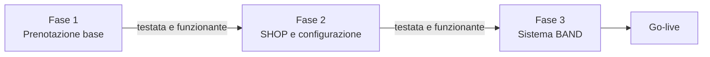

| Fase | Obiettivo | Criterio di uscita |
|------|-----------|-------------------|
| **1** | Prenotare una sala, pagare con Stripe, gestire da admin | Smoke test E2E verde su flusso completo |
| **2** | SHOP crediti, configurazione admin, funzioni avanzate | Pagamento crediti + admin config operativi e testati |
| **3** | BAND, quota associativa, inviti | Prenotazione vincolata a band (eccetto PROVI DA SOLO) testata |
| **4** | Produzione | Partenza pulita, redirect da SuperSaaS |

**Cosa resta nel design ma non si implementa subito:** BAND, SHOP, PROVI DA SOLO, calendari esterni, penali configurabili, onboarding quota — sono documentati per coerenza architetturale ma entrano nelle fasi 2 e 3.

---

### Fase 1 — Prenotazione base (MVP testabile)

**Obiettivo:** un associato può prenotare una sala e pagare; un admin può vedere e gestire le prenotazioni. **Niente altro finché questo non funziona.**

#### 1.0 Fondamenta

- ~~Database PostgreSQL + Prisma~~ → **Fatto (parziale):** Supabase + migrazioni 001–005; auth Supabase + `members`/`member_roles`.
- ~~Auth reale: login + sign up; flag `isAdmin`~~ → **Fatto:** Supabase Auth; ruoli via `member_roles` (`admin`, `docente`, `associato`, …).
- Middleware: `/admin/*` → admin/segreteria; route protette con Supabase session.
- Variabili ambiente: Supabase (ok); **mancano** Stripe sale, Google Calendar OAuth.
- **Divergenza:** il piano prevedeva *nessun vincolo quota/BAND in Fase 1*; **questo repo applica già** `member_quota_ok()` per gli associati. Decisione da prendere — vedi [`PIANO_PRENOTAZIONI_ALLINEAMENTO.md`](PIANO_PRENOTAZIONI_ALLINEAMENTO.md) §1.

#### 1.1 Spazi e config admin

- **Seed attuale:** `Sala 1`–`4` placeholder — valori SuperSaaS (Rossa/Verde/Arancio, tariffe) si impostano in **admin per sala**, non solo in migration.
- **Admin `/admin/spaces/[id]`:** tariffa oraria, orari apertura/chiusura, granularità slot, durata min/max, sconti per durata, PROVI DA SOLO, opzioni, pacchetti (vedi § Gestione spazi).
- **Motore booking:** legge config da DB; rimuovere costanti 09:00–22:00 / 60 min da `bookings.ts`.
- Collegamento calendario Google publish per spazio — **non fatto**.

#### 1.2 Motore disponibilità e prenotazioni (backend)

- **Parziale:** `getRoomAvailability()` + `create_booking_safe()` + Realtime; conflitto `UNIQUE(room_id, start_at)`.
- **Mancante:** motore availability/pricing che **legge config sala** (orari, slot, sconti durata); lead-time 12h/6h.
- API: create/list/cancel base ok; **mancano** dettaglio, stati `pending_approval`, pricing da config.
- Calcolo prezzo: **Fase 1** — `tariffa × ore` in DB e UI; formula completa con sconti/addon in Fase 2.
- Soglie anticipo: **non implementate** (piano: 12h auto / 6–12h approvazione / <6h rifiuto).
- Pagamento Stripe: placeholder `initiateRoomPayment()` — **non fatto**.
- Sync Google Calendar — **non fatto**.
- `bandId` sempre `null` — ok per Fase 1.

#### 1.3 UI Admin (minima)

- **Non fatto** — admin attuale: associati + rimborsi only.
- Da implementare: calendario/lista prenotazioni, approva/rifiuta, modifica base.

#### 1.4 UI Associato (wizard semplificato)

- **Parziale:** `/prenotazioni` (web) + tab mobile — selezione sala, griglia slot 1h, prenotazione senza pagamento.
- **Mancante:** wizard multi-step, pagamento Stripe, "Le mie prenotazioni", link da dashboard, bottom nav dedicata.
- Realtime slot refresh — **fatto** via `subscribeToBookings()`.

#### 1.5 Test (obbligatori prima di Fase 2)

| Test | Cosa verifica |
|------|---------------|
| **Unit** | `availability.ts`, `booking-pricing.ts`, `booking-lead-time.ts` |
| **API** | POST prenotazione, conflitto slot, soglie anticipo, stati |
| **Smoke E2E** | Login → scegli sala → slot → Stripe (test mode) → conferma → visibile in "Le mie" e admin |
| **Admin E2E** | Approva prenotazione pending → capture Stripe → sync Google Calendar |

**Gate Fase 2:** tutti i test sopra passano in CI o smoke manuale documentato.

---

### Fase 2 — SHOP, configurazione e dettagli aggiuntivi

**Prerequisito:** Fase 1 completa e testata.

#### 2.1 SHOP e crediti

- Ledger crediti (`CreditTransaction`), pacchetti (`CreditPackage`), acquisto via Stripe.
- Pagina `/dashboard/shop` mobile-friendly.
- Pagamento prenotazione con **crediti** o Stripe (scelta a step pagamento).
- Hold crediti su `pending_approval`; penali su cancellazione.

#### 2.2 Configurazione admin

- **CRUD spazi** + **pagina config per sala** (tariffe, orari, slot, sconti durata, PROVI DA SOLO, opzioni, pacchetti).
- **Admin → Impostazioni:** soglie anticipo (`autoConfirmMinHours`, `approvalMinHours`), `modifyMinHours`, `cancelMinHours`.
- **Penali cancellazione:** CRUD fasce (`CancellationPenaltyRule`).
- **PROVI DA SOLO:** flag + orari dedicati per sala (`ProviDaSoloSchedule`).
- Opzioni sala (microfoni, attrezzature, addon).
- Sconti a pacchetto durata (se definiti commercialmente).

#### 2.3 Calendari esterni (aule scuola)

- Admin: aggiungi calendario esterno per spazio (URL/ID Google pubblico).
- Cron sync → cache `ExternalCalendarEvent`.
- Integrazione in `availability.ts`: slot esterni = occupati.
- Dashboard admin: stato sync, errori.

#### 2.4 Admin avanzato e dettagli prenotazione

- **Edit completo** prenotazione: sposta, allunga, riduce, cambia sala.
- **SettlementMethodPicker:** crediti / contanti / metodo originale per differenze prezzo.
- `BookingAuditLog` + checkbox invio email su modifica.
- **Email conferma** post-prenotazione (template campi SuperSaaS).
- Wizard associato: step opzioni sala, PROVI DA SOLO (se configurato), badge "Richiede approvazione".

#### 2.5 Test Fase 2

- Acquisto pacchetto SHOP → saldo aggiornato.
- Prenotazione con crediti; hold e release su approvazione/rifiuto.
- Slot bloccato da calendario esterno non prenotabile.
- Admin modifica soglie → nuovo comportamento verificato.

**Gate Fase 3:** SHOP + config admin + PROVI DA SOLO operativi e testati.

---

### Fase 3 — Sistema BAND

**Prerequisito:** Fase 2 completa e testata.

#### 3.1 Onboarding e quota associativa

- Modulo iscrizione obbligatorio post-signup.
- Quota associativa anno in corso (Stripe); middleware blocca portale senza quota.
- `QuotaPayment` + `QuotaPaymentItem` per versamento singolo e multiplo.

#### 3.2 BAND

- CRUD band (`/dashboard/bands`); utente in più band.
- Flusso invito `/invite/[token]`: sign up → form → quota → join band.
- Versamento quota per conto altrui (checkout unico, riconciliazione).
- Validazione `band-validation.ts`: tutti i membri in regola prima di prenotare.

#### 3.3 Prenotazione vincolata a BAND

- Wizard: step **tipo sessione** (band / PROVI DA SOLO) → [selezione band] → sala → slot → opzioni → pagamento.
- `bandId` obbligatorio salvo `proviDaSolo === true`.
- Snapshot `memberIds` su prenotazione.
- Bottom nav: aggiunta voce **BAND**.
- Admin: vista band, conformità membri, storico versamenti quota.

#### 3.4 Test Fase 3

- **Smoke test E2E:** invito band → signup → form → quota → join → prenotazione membro non-founder.
- Versamento quota multiplo per membri band → tutti `active` → prenotazione consentita.
- PROVI DA SOLO salta BAND; prenotazione con band richiede tutti i membri in regola.

**Gate Go-live:** flusso BAND + quota + prenotazione end-to-end verificato.

---

### Fase 4 — Go-live (partenza pulita)

- **Nessuna migrazione** dati da SuperSaaS.
- Setup produzione: spazi, impostazioni, admin (`isAdmin = true`), calendari Google, calendari esterni scuola.
- Redirect da SuperSaaS a nuova app.
- Comunicazione agli associati per registrazione e creazione band.

~~Fase migrazione SuperSaaS~~ — **non prevista** (partenza pulita).

---

### Mappa funzionalità → fase

| Funzionalità | Fase |
|--------------|------|
| Auth login/signup + isAdmin | 1 |
| Seed sale + orari fissi | 1 |
| Disponibilità slot + API prenotazioni | 1 |
| Pagamento Stripe prenotazione | 1 |
| Admin calendario/lista + approva/rifiuta | 1 |
| Wizard associato (sala → slot → Stripe) | 1 |
| Google Calendar publish | 1 |
| Test E2E prenotazione base | 1 |
| SHOP pacchetti crediti | 2 |
| Pagamento con crediti + hold | 2 |
| CRUD spazi + impostazioni admin | 2 |
| PROVI DA SOLO (flag + orari) | 2 |
| Calendari esterni scuola | 2 |
| Penali, email conferma, edit admin completo | 2 |
| Onboarding + quota associativa | 3 |
| Sistema BAND + inviti | 3 |
| Prenotazione vincolata a band | 3 |
| Versamento quota per conto altrui | 3 |

---

## Gap e domande aperte

### Risolti in questa iterazione

- ~~Flusso associato~~ → wizard con band, slot, opzioni, pagamento.
- ~~Chi può accedere/prenotare~~ → iscritti con quota versata; prenotazione vincolata a band verificata.
- ~~Autodichiarazione quota SuperSaaS~~ → sostituita da verifica sistema + BAND.
- ~~Pagamento~~ → Stripe o crediti.
- ~~Acquisto crediti~~ → SHOP con pacchetti admin.
- ~~Approvazione~~ → soglie 12h/6h configurabili.
- ~~Spazi e tariffe~~ → Rossa 10€/h, Verde 15€/h, Arancio 15€/h.
- ~~Email conferma~~ → template con campi utili da SuperSaaS.
- ~~Policy cancellazione~~ → default 24h (da email SuperSaaS).
- ~~BAND inviti~~ → flusso guidato sign up → form → quota → join; smoke test E2E.
- ~~Multi-band~~ → sì, un utente può essere in più band.
- ~~Chi prenota~~ → tutti i membri `active`, non solo founder.
- ~~Quota membri band~~ → tutti in regola se prenotazione con band; solo prenotante se PROVI DA SOLO.
- ~~BAND obbligatoria~~ → sì, **eccetto PROVI DA SOLO**.
- ~~Modifica/annullamento admin~~ → calendario cliccabile, edit completo, soglie configurabili.
- ~~Google Calendar~~ → publish + import calendari esterni scuola.
- ~~Equivalenza crediti~~ → **1:1** con ore; non scadono.
- ~~Penali cancellazione~~ → fasce configurabili admin (es. 24–12h = 50%).
- ~~Pagamento pending_approval~~ → preautorizzazione; addebito dopo approvazione admin.
- ~~PROVI DA SOLO~~ → **flag** in config sala + **orari dedicati** per fascia; promo €/% da rifinire.
- ~~Migrazione~~ → **partenza pulita**, nessun import SuperSaaS.
- ~~Admin multipli~~ → sì, flag **`isAdmin`** su `User`.

### Ancora da chiarire

1. **Sconti a pacchetto durata** (su singola prenotazione) — cumulabili con pagamento crediti?

2. **PROVI DA SOLO — dettaglio promo** — valori commerciali finali (sconto €/%, etichetta); flag e orari già definiti.

### Piano completo

Tutti i gap architetturali principali sono **chiusi**. Restano solo dettagli commerciali (promo PROVI DA SOLO, sconti pacchetto durata) implementabili via configurazione admin senza cambiare il design.

---

## Decisioni tecniche Google Calendar

### Publish (MusicPro → Google)

Per `musicproeventi@gmail.com`, un calendario publish per spazio:

1. **OAuth 2.0** con refresh token (setup una tantum).
2. Alla creazione spazio: `calendars.insert` → salvare `googleCalendarId` in `Space`.
3. Su prenotazione confermata/modificata/cancellata: `events.insert/update/delete`.
4. Titolo evento: band + sala (o "PROVI DA SOLO" + prenotante), orario, membri.

### Import (Scuola musica → MusicPro)

Per ogni sala, uno o più calendari pubblici delle aule:

1. Admin configura `icalUrl` o `googleCalendarId` del calendario pubblico.
2. **Sync job** (cron ogni N minuti, default 10): `events.list` o parse iCal → upsert `ExternalCalendarEvent`.
3. Cancellazione eventi assenti nel feed al sync successivo.
4. `availability.ts` unisce: `SpaceOpeningHours` ∩ ¬`Booking` ∩ ¬`ExternalCalendarEvent`.
5. Solo lettura — nessuna scrittura sui calendari della scuola.

Job di riconciliazione opzionale per errori sync publish.

---

## File esistenti da estendere (MusicPro School)

### Già presenti — estendere, non riscrivere

| File | Azione |
|------|--------|
| `supabase/migrations/001_initial_schema.sql` | Estendere `rooms` + tabelle config (orari, sconti durata, opzioni) e `bookings` (stati, pagamento) |
| `supabase/migrations/005_booking_functions.sql` | Lead-time, pricing da config sala, stati `pending_approval` |
| `musicpro/packages/database/src/bookings.ts` | Availability/pricing da config DB; rimuovere hardcode slot |
| `musicpro/apps/web/src/app/admin/spaces/[id]/page.tsx` | **Nuova** — pagina config sala |
| `musicpro/apps/web/src/app/prenotazioni/page.tsx` | Wizard, pagamento Stripe, link da dashboard |
| `musicpro/apps/mobile/app/(tabs)/prenotazioni.tsx` | Parità funzionale con web |
| `musicpro/apps/web/src/app/dashboard/page.tsx` | Link a Prenotazioni / Le mie prenotazioni |
| `musicpro/apps/web/src/app/admin/*` | Nuove rotte `bookings/`, `spaces/`, `settings/` |

### Documentazione correlata

| File | Contenuto |
|------|-----------|
| `musicpro/packages/database/README.md` | Regole booking attuali (quota, slot, Realtime) |
| `docs/GAS_DEPRECATION.md` §2.6 | Booking = feature nuova, non in GAS |
| `docs/CUTOVER_CHECKLIST.md` | Test booking pre/post cutover |
| `docs/PIANO_PRENOTAZIONI_ALLINEAMENTO.md` | Gap, dubbi, sovrapposizioni |

> I path `src/app/...` del piano originale (MusicPro-APP-Associati) **non applicano** a questo repo.

---

## Prossimo passo (MusicPro School)

1. **Chiudere Fase 1** — schema config sala + motore availability/pricing da DB; admin spazi (MVP) + admin prenotazioni; Stripe sale; Google Calendar publish; test E2E.
2. **Riconciliare divergenze** — quota già in Fase 1; BAND Fase 3; vedi allineamento.
3. **Gate Fase 2** — UI admin completa (sconti durata, PROVI DA SOLO, penali), SHOP crediti, calendari esterni.
4. **Fase 3** — BAND, inviti, versamento quota multiplo.
